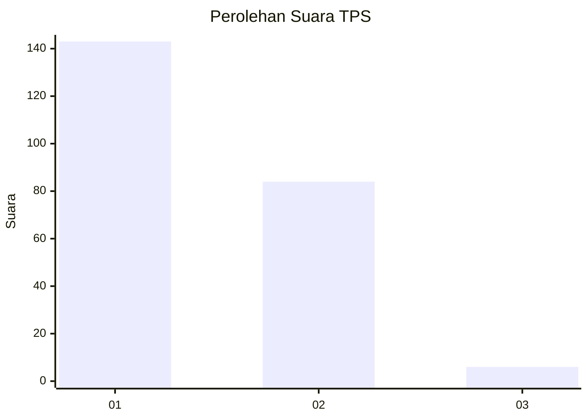
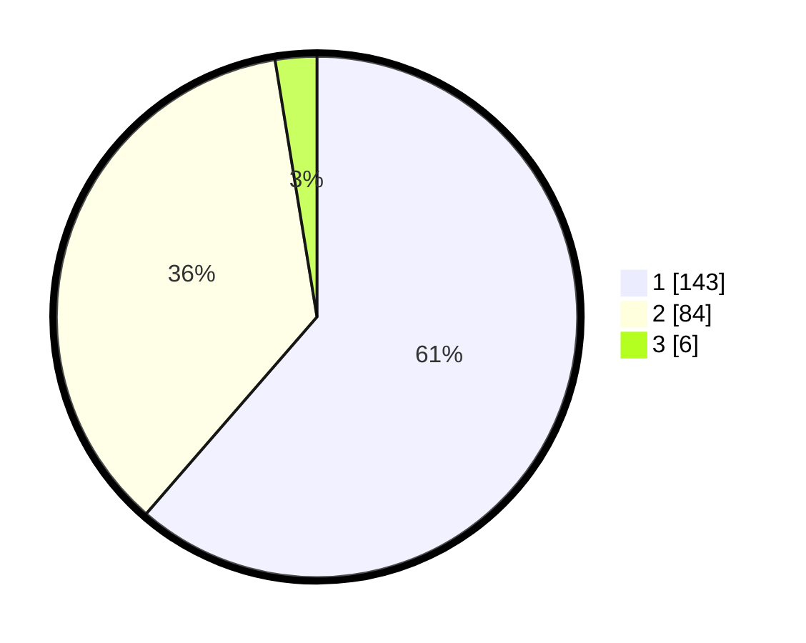

# Hasil

## Grafik

## Tabel

| No. | Nama Paslon    | Suara | Suara (raw) | Persentase |
|:--- |:-------------- | -----:| -----------:| ----------:|
| 1   | ANIES MUHAIMIN | 143   | [143][p-1]  | 61,37      |
| 2   | PRABOWO GIBRAN | 84    | [84][p-2]   | 36,05      |
| 3   | GANJAR MAHFUD  | 6     | [6][p-3]    | 2,58       |

[p-1]: https://github.com/gigit-pemilu/pemilu-2024-11-aceh/blob/main/pilpres/hitung-suara/sub/11-aceh/sub/75-kota-subulussalam/sub/03-rundeng/sub/2008-muara-batu-batu/sub/001-tps/sub/paslon-1.txt
[p-2]: https://github.com/gigit-pemilu/pemilu-2024-11-aceh/blob/main/pilpres/hitung-suara/sub/11-aceh/sub/75-kota-subulussalam/sub/03-rundeng/sub/2008-muara-batu-batu/sub/001-tps/sub/paslon-2.txt
[p-3]: https://github.com/gigit-pemilu/pemilu-2024-11-aceh/blob/main/pilpres/hitung-suara/sub/11-aceh/sub/75-kota-subulussalam/sub/03-rundeng/sub/2008-muara-batu-batu/sub/001-tps/sub/paslon-3.txt

## Foto C Plano

https://sirekap-obj-formc.kpu.go.id/b1c6/pemilu/ppwp/11/75/03/20/08/1175032008001-20240221-104248--189d7fcc-e2f0-44c1-8932-e977220dead9.jpg

https://sirekap-obj-formc.kpu.go.id/b1c6/pemilu/ppwp/11/75/03/20/08/1175032008001-20240221-104402--544b7e7b-3f8c-47e8-a640-7d3620becf87.jpg

https://sirekap-obj-formc.kpu.go.id/b1c6/pemilu/ppwp/11/75/03/20/08/1175032008001-20240221-104505--2e3b4ca3-a831-4ded-8209-ab79fa62aa1a.jpg

## Metadata

| Key        | Value               |
| ---------- | ------------------- |
| Time Stamp | 2024-02-21 11:00:00 |

## DATA PEMILIH TETAP

Jumlah pemilih dalam DPT: **277**.
 * L: **744**.
 * P: **133**.

## DATA PENGGUNA HAK PILIH

Jumlah pengguna hak pilih dalam DPT: **266**.
 * L: **151**.
 * P: **375**.

Jumlah pengguna hak pilih dalam DPTb: **1**.
 * L: **0**.
 * P: **2**.

Jumlah pengguna hak pilih dalam DPK: **3**.
 * L: **3**.
 * P: **0**.

Jumlah pengguna hak pilih: **270**.
 * L: **154**.
 * P: **116**.

## JUMLAH SUARA SAH DAN TIDAK SAH

JUMLAH SELURUH SUARA SAH: **238**.

JUMLAH SUARA TIDAK SAH: **32**.

JUMLAH SELURUH SUARA SAH DAN SUARA TIDAK SAH: **270**.

