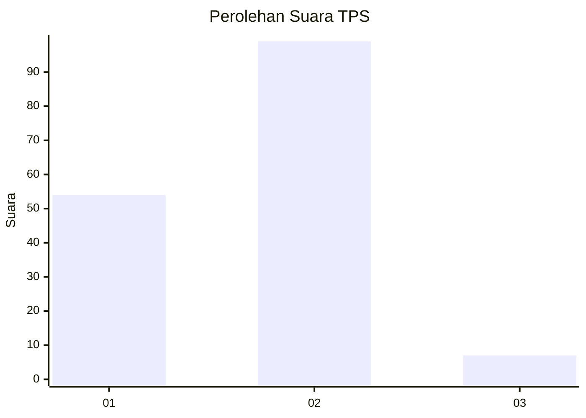
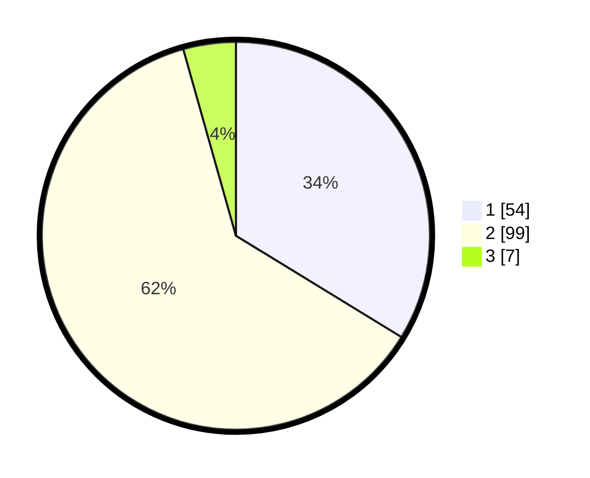

# Hasil

## Grafik

## Tabel

| No. | Nama Paslon    | Suara | Suara (raw) | Persentase |
|:--- |:-------------- | -----:| -----------:| ----------:|
| 1   | ANIES MUHAIMIN | 54    | [54][p-1]   | 33,75      |
| 2   | PRABOWO GIBRAN | 99    | [99][p-2]   | 61,88      |
| 3   | GANJAR MAHFUD  | 7     | [7][p-3]    | 4,38       |

[p-1]: https://github.com/gigit-pemilu/pemilu-2024-11-aceh/blob/main/pilpres/hitung-suara/sub/11-aceh/sub/75-kota-subulussalam/sub/03-rundeng/sub/2008-muara-batu-batu/sub/003-tps/sub/paslon-1.txt
[p-2]: https://github.com/gigit-pemilu/pemilu-2024-11-aceh/blob/main/pilpres/hitung-suara/sub/11-aceh/sub/75-kota-subulussalam/sub/03-rundeng/sub/2008-muara-batu-batu/sub/003-tps/sub/paslon-2.txt
[p-3]: https://github.com/gigit-pemilu/pemilu-2024-11-aceh/blob/main/pilpres/hitung-suara/sub/11-aceh/sub/75-kota-subulussalam/sub/03-rundeng/sub/2008-muara-batu-batu/sub/003-tps/sub/paslon-3.txt

## Foto C Plano

https://sirekap-obj-formc.kpu.go.id/8ccd/pemilu/ppwp/11/75/03/20/08/1175032008003-20240221-132632--c4d78de4-804c-4790-90db-360fe6077ea1.jpg

https://sirekap-obj-formc.kpu.go.id/8ccd/pemilu/ppwp/11/75/03/20/08/1175032008003-20240221-132949--18c63032-a6c3-42f7-b959-a33655757084.jpg

https://sirekap-obj-formc.kpu.go.id/8ccd/pemilu/ppwp/11/75/03/20/08/1175032008003-20240221-133043--af388127-b593-414d-849b-3c56588ee1e1.jpg

## Metadata

| Key        | Value               |
| ---------- | ------------------- |
| Time Stamp | 2024-02-21 14:00:00 |

## DATA PEMILIH TETAP

Jumlah pemilih dalam DPT: **290**.
 * L: **140**.
 * P: **150**.

## DATA PENGGUNA HAK PILIH

Jumlah pengguna hak pilih dalam DPT: **277**.
 * L: **131**.
 * P: **144**.

Jumlah pengguna hak pilih dalam DPTb: **2**.
 * L: **1**.
 * P: **1**.

Jumlah pengguna hak pilih dalam DPK: **1**.
 * L: **0**.
 * P: **1**.

Jumlah pengguna hak pilih: **278**.
 * L: **132**.
 * P: **146**.

## JUMLAH SUARA SAH DAN TIDAK SAH

JUMLAH SELURUH SUARA SAH: **260**.

JUMLAH SUARA TIDAK SAH: **818**.

JUMLAH SELURUH SUARA SAH DAN SUARA TIDAK SAH: **278**.

