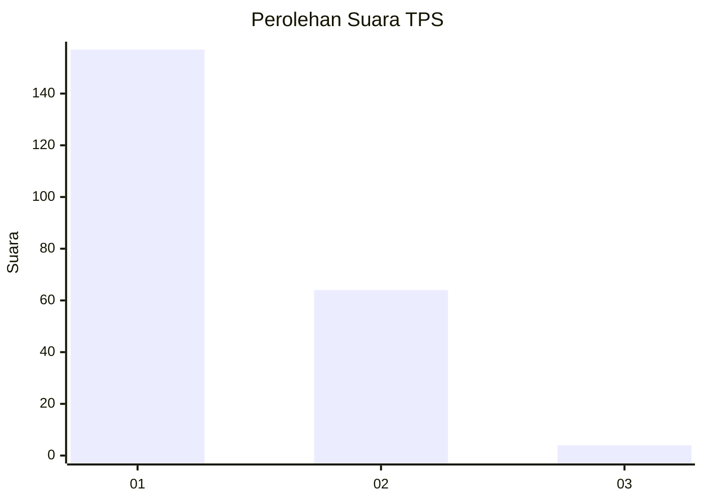
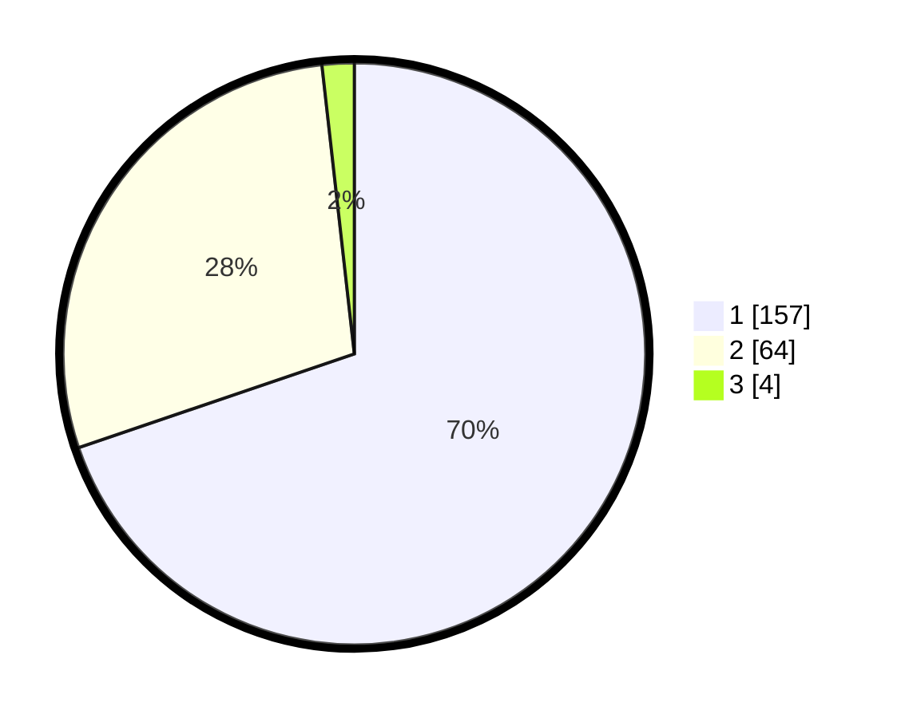

# Hasil

## Grafik

## Tabel

| No. | Nama Paslon    | Suara | Suara (raw) | Persentase |
|:--- |:-------------- | -----:| -----------:| ----------:|
| 1   | ANIES MUHAIMIN | 157   | [157][p-1]  | 69,78      |
| 2   | PRABOWO GIBRAN | 64    | [64][p-2]   | 28,44      |
| 3   | GANJAR MAHFUD  | 4     | [4][p-3]    | 1,78       |

[p-1]: https://github.com/gigit-pemilu/pemilu-2024-11-aceh/blob/main/pilpres/hitung-suara/sub/11-aceh/sub/75-kota-subulussalam/sub/03-rundeng/sub/2009-siperkas/sub/001-tps/sub/paslon-1.txt
[p-2]: https://github.com/gigit-pemilu/pemilu-2024-11-aceh/blob/main/pilpres/hitung-suara/sub/11-aceh/sub/75-kota-subulussalam/sub/03-rundeng/sub/2009-siperkas/sub/001-tps/sub/paslon-2.txt
[p-3]: https://github.com/gigit-pemilu/pemilu-2024-11-aceh/blob/main/pilpres/hitung-suara/sub/11-aceh/sub/75-kota-subulussalam/sub/03-rundeng/sub/2009-siperkas/sub/001-tps/sub/paslon-3.txt

## Foto C Plano

https://sirekap-obj-formc.kpu.go.id/dbec/pemilu/ppwp/11/75/03/20/09/1175032009001-20240223-190330--44155dcd-17cb-4da0-9a55-1355c9941299.jpg

https://sirekap-obj-formc.kpu.go.id/dbec/pemilu/ppwp/11/75/03/20/09/1175032009001-20240223-190932--07dbbf9f-c14e-4611-9ea8-ec29430bb9ac.jpg

https://sirekap-obj-formc.kpu.go.id/dbec/pemilu/ppwp/11/75/03/20/09/1175032009001-20240223-191127--462b4143-4702-43c5-97c6-710d17865ce5.jpg

## Metadata

| Key        | Value               |
| ---------- | ------------------- |
| Time Stamp | 2024-02-24 22:31:28 |

## DATA PEMILIH TETAP

Jumlah pemilih dalam DPT: **0**.
 * L: **0**.
 * P: **0**.

## DATA PENGGUNA HAK PILIH

Jumlah pengguna hak pilih dalam DPT: **700**.
 * L: **777**.
 * P: **775**.

Jumlah pengguna hak pilih dalam DPTb: **0**.
 * L: **775**.
 * P: **775**.

Jumlah pengguna hak pilih dalam DPK: **700**.
 * L: **115**.
 * P: **175**.

Jumlah pengguna hak pilih: **0**.
 * L: **0**.
 * P: **0**.

## JUMLAH SUARA SAH DAN TIDAK SAH

JUMLAH SELURUH SUARA SAH: **631**.

JUMLAH SUARA TIDAK SAH: **7**.

JUMLAH SELURUH SUARA SAH DAN SUARA TIDAK SAH: **238**.

