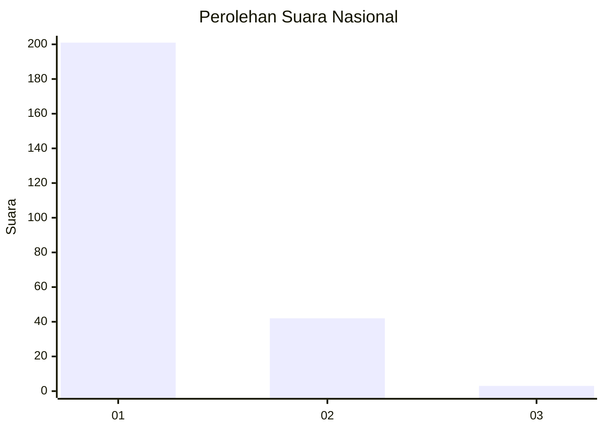
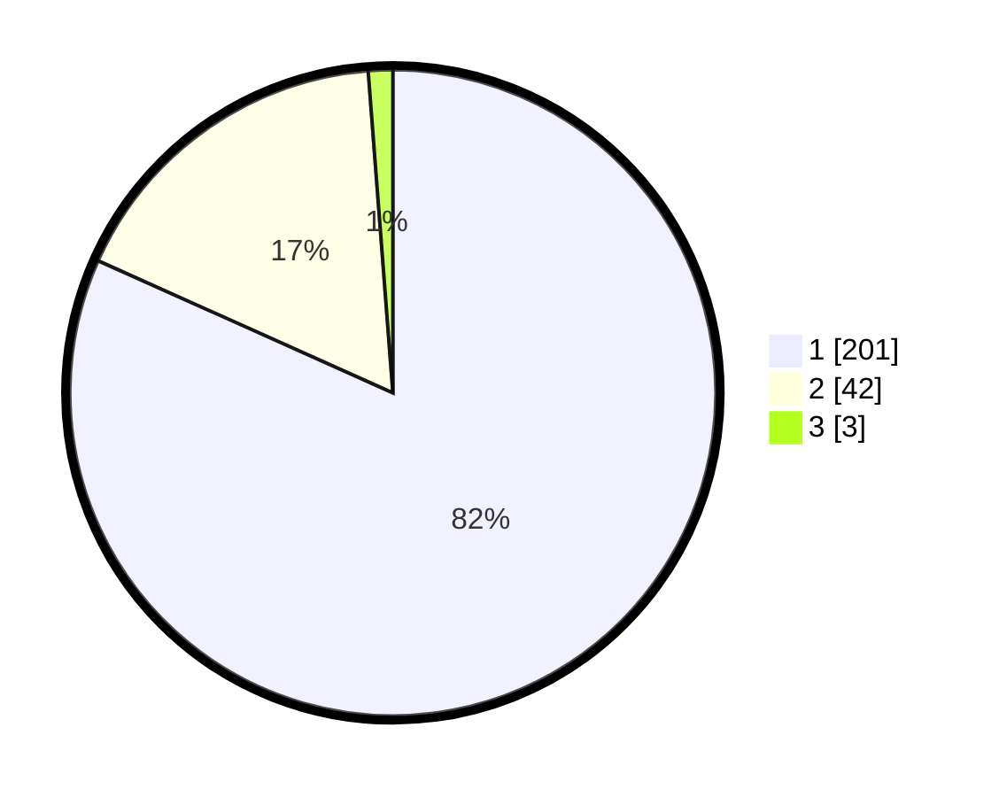

# Hasil

## Grafik

## Tabel

| No. | Nama Paslon    | Suara | Suara (raw) | Persentase |
|:--- |:-------------- | -----:| -----------:| ----------:|
| 1   | ANIES MUHAIMIN | 201   | [201][p-1]  | 81,71      |
| 2   | PRABOWO GIBRAN | 42    | [42][p-2]   | 17,07      |
| 3   | GANJAR MAHFUD  | 3     | [3][p-3]    | 1,22       |

[p-1]: https://github.com/gigit-pemilu/pemilu-2024/blob/main/pilpres/hitung-suara/sub/11-aceh/sub/75-kota-subulussalam/sub/03-rundeng/sub/2010-lae-mate/sub/001-tps/sub/paslon-1.txt
[p-2]: https://github.com/gigit-pemilu/pemilu-2024/blob/main/pilpres/hitung-suara/sub/11-aceh/sub/75-kota-subulussalam/sub/03-rundeng/sub/2010-lae-mate/sub/001-tps/sub/paslon-2.txt
[p-3]: https://github.com/gigit-pemilu/pemilu-2024/blob/main/pilpres/hitung-suara/sub/11-aceh/sub/75-kota-subulussalam/sub/03-rundeng/sub/2010-lae-mate/sub/001-tps/sub/paslon-3.txt

## Foto C Plano

https://sirekap-obj-formc.kpu.go.id/2304/pemilu/ppwp/11/75/03/20/10/1175032010001-20240218-211349--de24cb4c-05a0-42b4-836b-fb944ef24468.jpg

https://sirekap-obj-formc.kpu.go.id/2304/pemilu/ppwp/11/75/03/20/10/1175032010001-20240215-112456--033fb4ca-9fae-484a-a76f-c7ba9cc37b7f.jpg

https://sirekap-obj-formc.kpu.go.id/2304/pemilu/ppwp/11/75/03/20/10/1175032010001-20240215-112644--7a292f9b-146d-48da-b080-67cae681f903.jpg

## Metadata

| Key        | Value               |
| ---------- | ------------------- |
| Time Stamp | 2024-02-19 15:00:00 |

