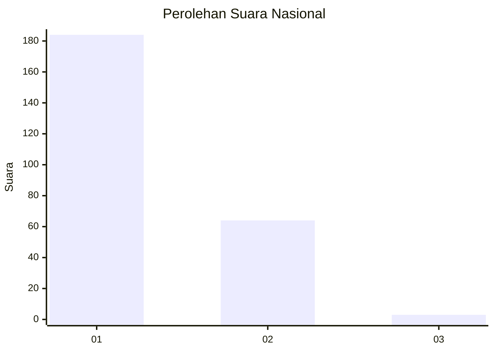
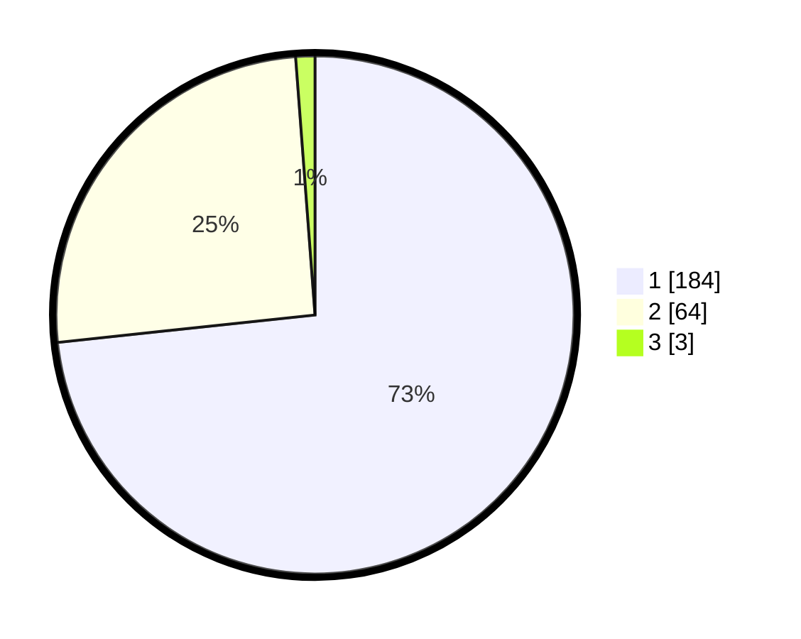

# Hasil

## Grafik

## Tabel

| No. | Nama Paslon    | Suara | Suara (raw) | Persentase |
|:--- |:-------------- | -----:| -----------:| ----------:|
| 1   | ANIES MUHAIMIN | 184   | [184][p-1]  | 73,31      |
| 2   | PRABOWO GIBRAN | 64    | [64][p-2]   | 25,50      |
| 3   | GANJAR MAHFUD  | 3     | [3][p-3]    | 1,20       |

[p-1]: https://github.com/gigit-pemilu/pemilu-2024/blob/main/pilpres/hitung-suara/sub/11-aceh/sub/75-kota-subulussalam/sub/03-rundeng/sub/2010-lae-mate/sub/003-tps/sub/paslon-1.txt
[p-2]: https://github.com/gigit-pemilu/pemilu-2024/blob/main/pilpres/hitung-suara/sub/11-aceh/sub/75-kota-subulussalam/sub/03-rundeng/sub/2010-lae-mate/sub/003-tps/sub/paslon-2.txt
[p-3]: https://github.com/gigit-pemilu/pemilu-2024/blob/main/pilpres/hitung-suara/sub/11-aceh/sub/75-kota-subulussalam/sub/03-rundeng/sub/2010-lae-mate/sub/003-tps/sub/paslon-3.txt

## Foto C Plano

https://sirekap-obj-formc.kpu.go.id/aa7a/pemilu/ppwp/11/75/03/20/10/1175032010003-20240215-143632--aa727a27-ef9f-401d-bb32-4c8b62c0e49e.jpg

https://sirekap-obj-formc.kpu.go.id/aa7a/pemilu/ppwp/11/75/03/20/10/1175032010003-20240215-143924--d0d15948-a9ea-4881-8439-4177202f454b.jpg

https://sirekap-obj-formc.kpu.go.id/aa7a/pemilu/ppwp/11/75/03/20/10/1175032010003-20240215-144011--992657e0-941e-4e6f-8893-489edc81501b.jpg

## Metadata

| Key        | Value               |
| ---------- | ------------------- |
| Time Stamp | 2024-02-15 23:29:50 |

