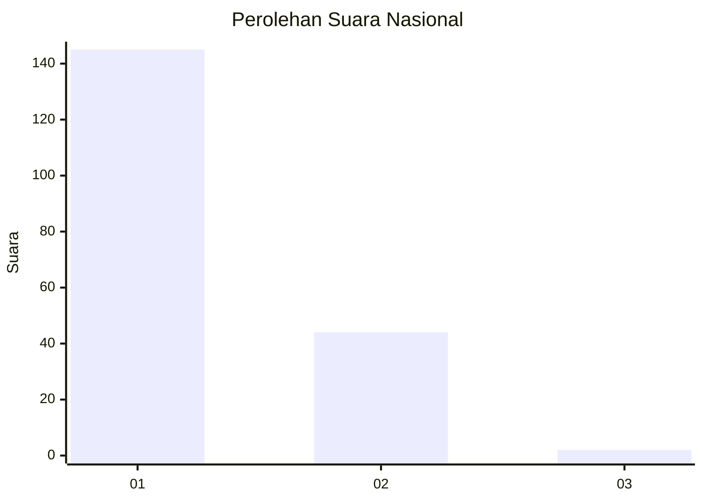
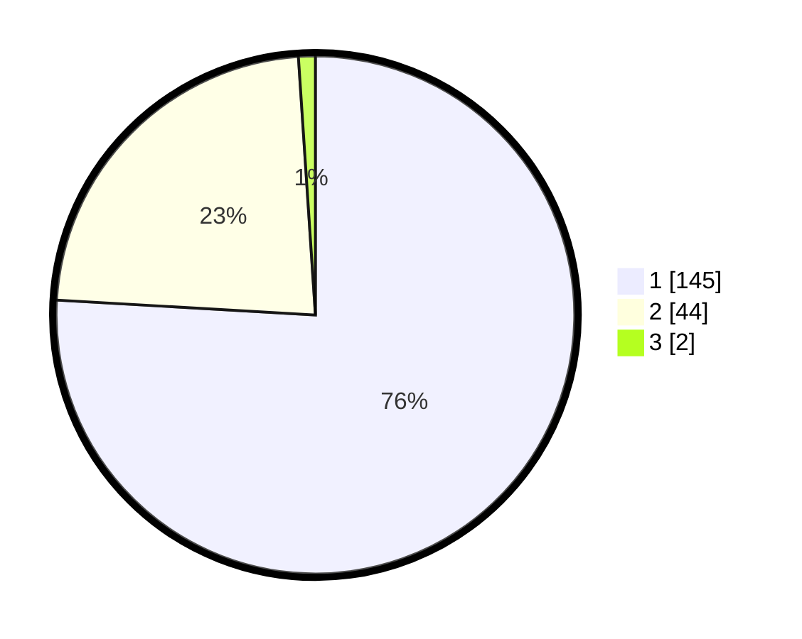

# Hasil

## Grafik

## Tabel

| No. | Nama Paslon    | Suara | Suara (raw) | Persentase |
|:--- |:-------------- | -----:| -----------:| ----------:|
| 1   | ANIES MUHAIMIN | 145   | [145][p-1]  | 75,92      |
| 2   | PRABOWO GIBRAN | 44    | [44][p-2]   | 23,04      |
| 3   | GANJAR MAHFUD  | 2     | [2][p-3]    | 1,05       |

[p-1]: https://github.com/gigit-pemilu/pemilu-2024/blob/main/pilpres/hitung-suara/sub/11-aceh/sub/75-kota-subulussalam/sub/03-rundeng/sub/2010-lae-mate/sub/004-tps/sub/paslon-1.txt
[p-2]: https://github.com/gigit-pemilu/pemilu-2024/blob/main/pilpres/hitung-suara/sub/11-aceh/sub/75-kota-subulussalam/sub/03-rundeng/sub/2010-lae-mate/sub/004-tps/sub/paslon-2.txt
[p-3]: https://github.com/gigit-pemilu/pemilu-2024/blob/main/pilpres/hitung-suara/sub/11-aceh/sub/75-kota-subulussalam/sub/03-rundeng/sub/2010-lae-mate/sub/004-tps/sub/paslon-3.txt

## Foto C Plano

https://sirekap-obj-formc.kpu.go.id/4d2e/pemilu/ppwp/11/75/03/20/10/1175032010004-20240219-141508--0e9a8881-db16-472e-9699-b1a7d3fac008.jpg

https://sirekap-obj-formc.kpu.go.id/4d2e/pemilu/ppwp/11/75/03/20/10/1175032010004-20240219-141554--81ecdbb2-1e65-4dd0-b12f-e472b2866521.jpg

https://sirekap-obj-formc.kpu.go.id/4d2e/pemilu/ppwp/11/75/03/20/10/1175032010004-20240219-141638--6aa135bb-3c9c-419f-a884-8be0b4e90a85.jpg

## Metadata

| Key        | Value               |
| ---------- | ------------------- |
| Time Stamp | 2024-02-19 15:00:00 |

## DATA PEMILIH TETAP

Jumlah pemilih dalam DPT: **1**.
 * L: **0**.
 * P: **0**.

## DATA PENGGUNA HAK PILIH

Jumlah pengguna hak pilih dalam DPT: **1**.
 * L: **0**.
 * P: **0**.

Jumlah pengguna hak pilih dalam DPTb: **96**.
 * L: **444**.
 * P: **914**.

Jumlah pengguna hak pilih dalam DPK: **201**.
 * L: **244**.
 * P: **204**.

Jumlah pengguna hak pilih: **851**.
 * L: **434**.
 * P: **224**.

## JUMLAH SUARA SAH DAN TIDAK SAH

JUMLAH SELURUH SUARA SAH: **191**.

JUMLAH SUARA TIDAK SAH: **15**.

JUMLAH SELURUH SUARA SAH DAN SUARA TIDAK SAH: **206**.

