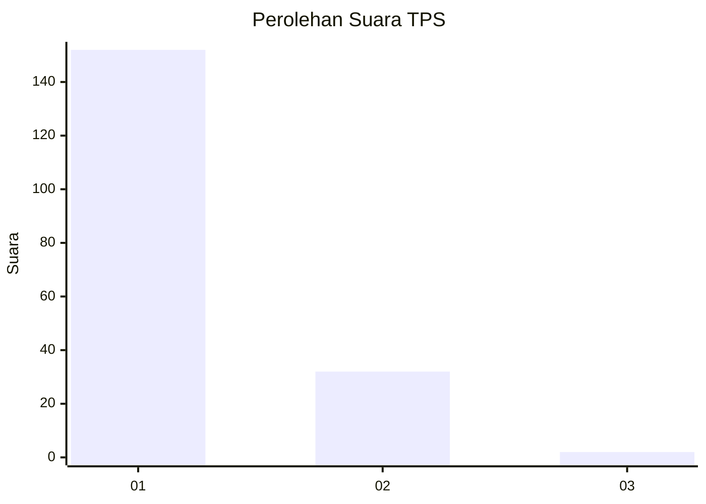
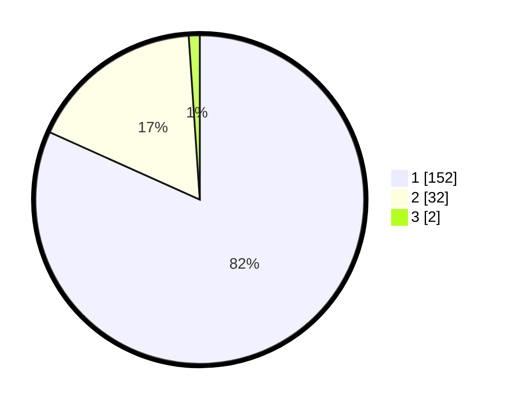

# Hasil

## Grafik

## Tabel

| No. | Nama Paslon    | Suara | Suara (raw) | Persentase |
|:--- |:-------------- | -----:| -----------:| ----------:|
| 1   | ANIES MUHAIMIN | 152   | [152][p-1]  | 81,72      |
| 2   | PRABOWO GIBRAN | 32    | [32][p-2]   | 17,20      |
| 3   | GANJAR MAHFUD  | 2     | [2][p-3]    | 1,08       |

[p-1]: https://github.com/gigit-pemilu/pemilu-2024-11-aceh/blob/main/pilpres/hitung-suara/sub/11-aceh/sub/75-kota-subulussalam/sub/03-rundeng/sub/2011-sibungke/sub/001-tps/sub/paslon-1.txt
[p-2]: https://github.com/gigit-pemilu/pemilu-2024-11-aceh/blob/main/pilpres/hitung-suara/sub/11-aceh/sub/75-kota-subulussalam/sub/03-rundeng/sub/2011-sibungke/sub/001-tps/sub/paslon-2.txt
[p-3]: https://github.com/gigit-pemilu/pemilu-2024-11-aceh/blob/main/pilpres/hitung-suara/sub/11-aceh/sub/75-kota-subulussalam/sub/03-rundeng/sub/2011-sibungke/sub/001-tps/sub/paslon-3.txt

## Foto C Plano

https://sirekap-obj-formc.kpu.go.id/a649/pemilu/ppwp/11/75/03/20/11/1175032011001-20240222-162608--270721c6-60a8-4dcf-b5f7-2e49adfc1697.jpg

https://sirekap-obj-formc.kpu.go.id/a649/pemilu/ppwp/11/75/03/20/11/1175032011001-20240222-162821--bb8cdcf6-065d-44a6-8068-799a887ef202.jpg

https://sirekap-obj-formc.kpu.go.id/a649/pemilu/ppwp/11/75/03/20/11/1175032011001-20240222-163011--53b7232d-11da-4352-93f7-6ba7970af60d.jpg

## Metadata

| Key        | Value               |
| ---------- | ------------------- |
| Time Stamp | 2024-02-22 17:00:00 |

## DATA PEMILIH TETAP

Jumlah pemilih dalam DPT: **216**.
 * L: **97**.
 * P: **114**.

## DATA PENGGUNA HAK PILIH

Jumlah pengguna hak pilih dalam DPT: **94**.
 * L: **84**.
 * P: **458**.

Jumlah pengguna hak pilih dalam DPTb: **8**.
 * L: **0**.
 * P: **800**.

Jumlah pengguna hak pilih dalam DPK: **2**.
 * L: **2**.
 * P: **0**.

Jumlah pengguna hak pilih: **196**.
 * L: **88**.
 * P: **109**.

## JUMLAH SUARA SAH DAN TIDAK SAH

JUMLAH SELURUH SUARA SAH: **186**.

JUMLAH SUARA TIDAK SAH: **410**.

JUMLAH SELURUH SUARA SAH DAN SUARA TIDAK SAH: **196**.

