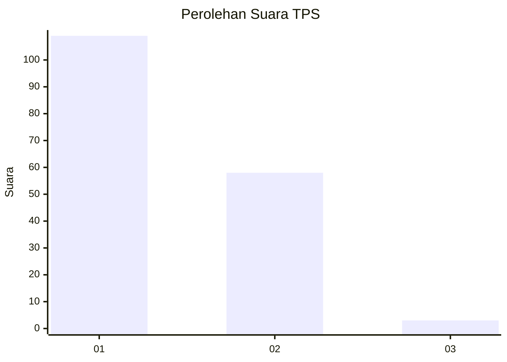
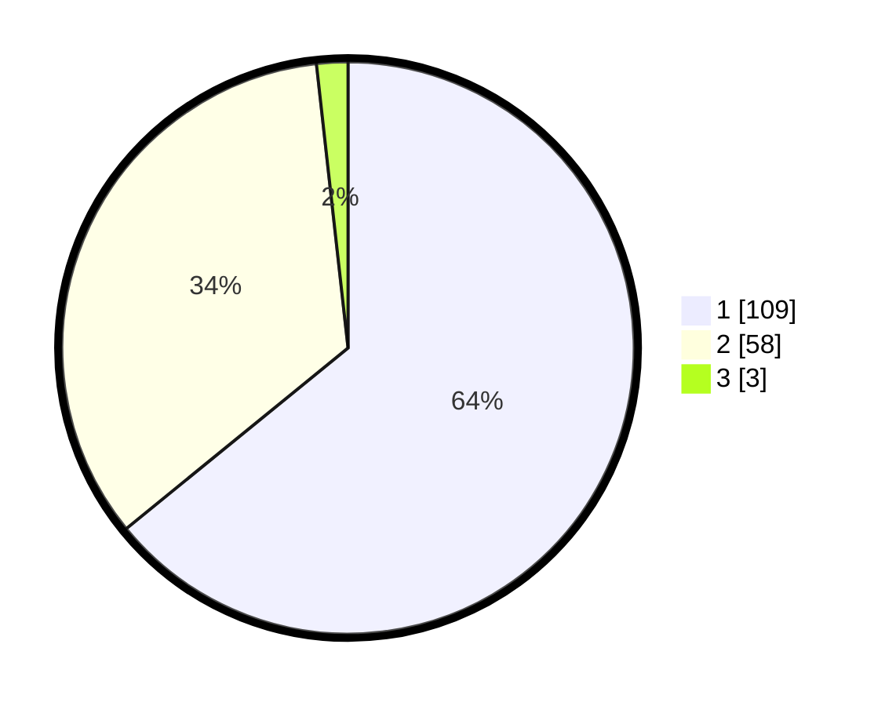

# Hasil

## Grafik

## Tabel

| No. | Nama Paslon    | Suara | Suara (raw) | Persentase |
|:--- |:-------------- | -----:| -----------:| ----------:|
| 1   | ANIES MUHAIMIN | 109   | [109][p-1]  | 64,12      |
| 2   | PRABOWO GIBRAN | 58    | [58][p-2]   | 34,12      |
| 3   | GANJAR MAHFUD  | 3     | [3][p-3]    | 1,76       |

[p-1]: https://github.com/gigit-pemilu/pemilu-2024-11-aceh/blob/main/pilpres/hitung-suara/sub/11-aceh/sub/75-kota-subulussalam/sub/03-rundeng/sub/2014-bulukur-makmur/sub/003-tps/sub/paslon-1.txt
[p-2]: https://github.com/gigit-pemilu/pemilu-2024-11-aceh/blob/main/pilpres/hitung-suara/sub/11-aceh/sub/75-kota-subulussalam/sub/03-rundeng/sub/2014-bulukur-makmur/sub/003-tps/sub/paslon-2.txt
[p-3]: https://github.com/gigit-pemilu/pemilu-2024-11-aceh/blob/main/pilpres/hitung-suara/sub/11-aceh/sub/75-kota-subulussalam/sub/03-rundeng/sub/2014-bulukur-makmur/sub/003-tps/sub/paslon-3.txt

## Foto C Plano

https://sirekap-obj-formc.kpu.go.id/90fd/pemilu/ppwp/11/75/03/20/14/1175032014003-20240215-065907--5f3d504c-8510-438d-b0c4-b59cdaafbfaa.jpg

https://sirekap-obj-formc.kpu.go.id/90fd/pemilu/ppwp/11/75/03/20/14/1175032014003-20240215-065940--c60d1bab-7eef-4394-b83a-d6741c8d3ba2.jpg

https://sirekap-obj-formc.kpu.go.id/90fd/pemilu/ppwp/11/75/03/20/14/1175032014003-20240223-221239--57cd97d8-be0f-4689-9e52-612db9930683.jpg

## Metadata

| Key        | Value               |
| ---------- | ------------------- |
| Time Stamp | 2024-02-24 22:31:28 |

## DATA PEMILIH TETAP

Jumlah pemilih dalam DPT: **196**.
 * L: **92**.
 * P: **104**.

## DATA PENGGUNA HAK PILIH

Jumlah pengguna hak pilih dalam DPT: **182**.
 * L: **85**.
 * P: **97**.

Jumlah pengguna hak pilih dalam DPTb: **0**.
 * L: **0**.
 * P: **0**.

Jumlah pengguna hak pilih dalam DPK: **182**.
 * L: **85**.
 * P: **97**.

Jumlah pengguna hak pilih: **182**.
 * L: **85**.
 * P: **97**.

## JUMLAH SUARA SAH DAN TIDAK SAH

JUMLAH SELURUH SUARA SAH: **370**.

JUMLAH SUARA TIDAK SAH: **77**.

JUMLAH SELURUH SUARA SAH DAN SUARA TIDAK SAH: **187**.

