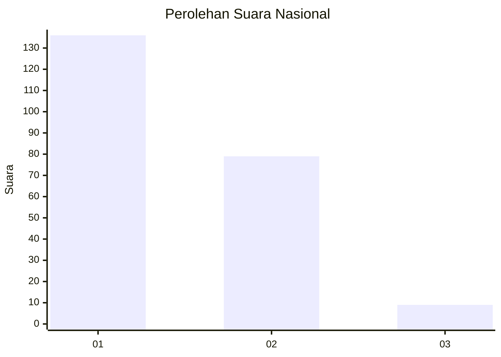
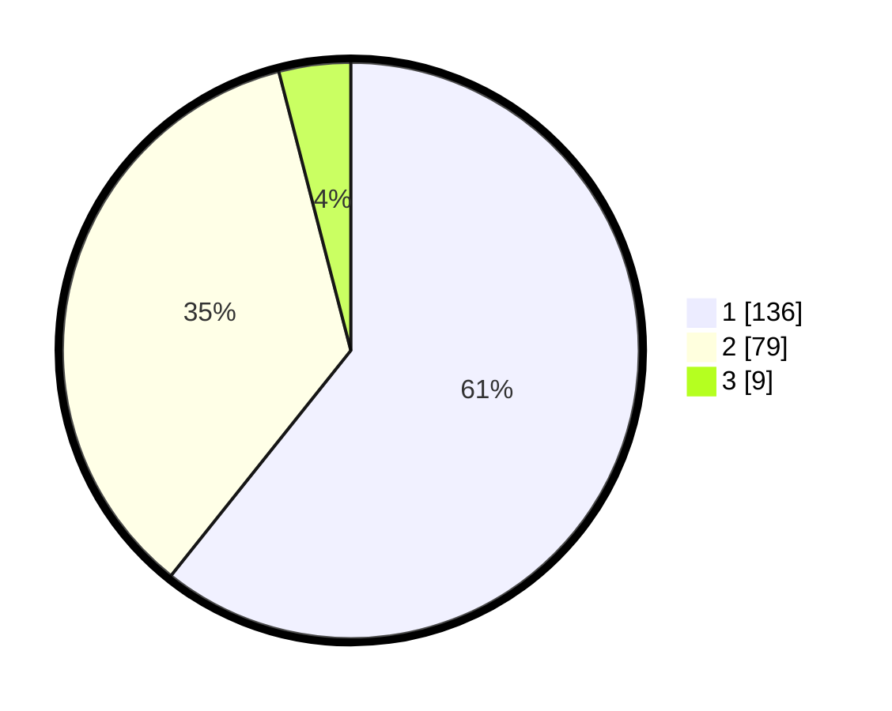

# Hasil

## Grafik

## Tabel

| No. | Nama Paslon    | Suara | Suara (raw) | Persentase |
|:--- |:-------------- | -----:| -----------:| ----------:|
| 1   | ANIES MUHAIMIN | 136   | [136][p-1]  | 60,71      |
| 2   | PRABOWO GIBRAN | 79    | [79][p-2]   | 35,27      |
| 3   | GANJAR MAHFUD  | 9     | [9][p-3]    | 4,02       |

[p-1]: https://github.com/gigit-pemilu/pemilu-2024/blob/main/pilpres/hitung-suara/sub/11-aceh/sub/75-kota-subulussalam/sub/03-rundeng/sub/2016-lae-pemulaan/sub/002-tps/sub/paslon-1.txt
[p-2]: https://github.com/gigit-pemilu/pemilu-2024/blob/main/pilpres/hitung-suara/sub/11-aceh/sub/75-kota-subulussalam/sub/03-rundeng/sub/2016-lae-pemulaan/sub/002-tps/sub/paslon-2.txt
[p-3]: https://github.com/gigit-pemilu/pemilu-2024/blob/main/pilpres/hitung-suara/sub/11-aceh/sub/75-kota-subulussalam/sub/03-rundeng/sub/2016-lae-pemulaan/sub/002-tps/sub/paslon-3.txt

## Foto C Plano

https://sirekap-obj-formc.kpu.go.id/4450/pemilu/ppwp/11/75/03/20/16/1175032016002-20240220-170502--9be8149d-04fc-4095-9a45-3eff5d3ab353.jpg

https://sirekap-obj-formc.kpu.go.id/4450/pemilu/ppwp/11/75/03/20/16/1175032016002-20240214-200554--d8e8c633-8221-4e25-87e0-98ba59be3f01.jpg

https://sirekap-obj-formc.kpu.go.id/4450/pemilu/ppwp/11/75/03/20/16/1175032016002-20240214-200554--c4f9c6dc-eff7-42d1-841b-5def7a09e936.jpg

## Metadata

| Key        | Value               |
| ---------- | ------------------- |
| Time Stamp | 2024-02-20 18:00:00 |

