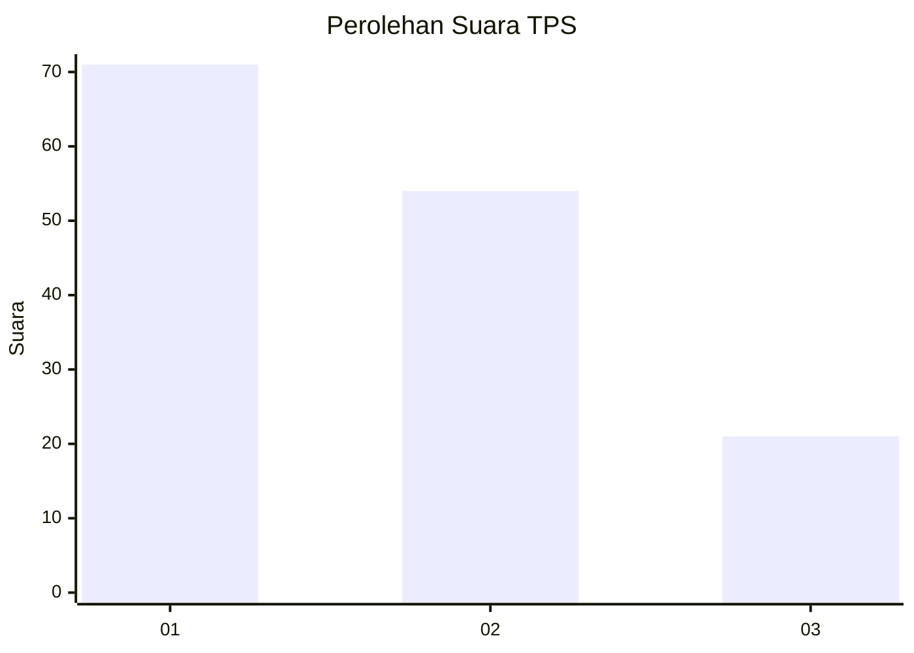
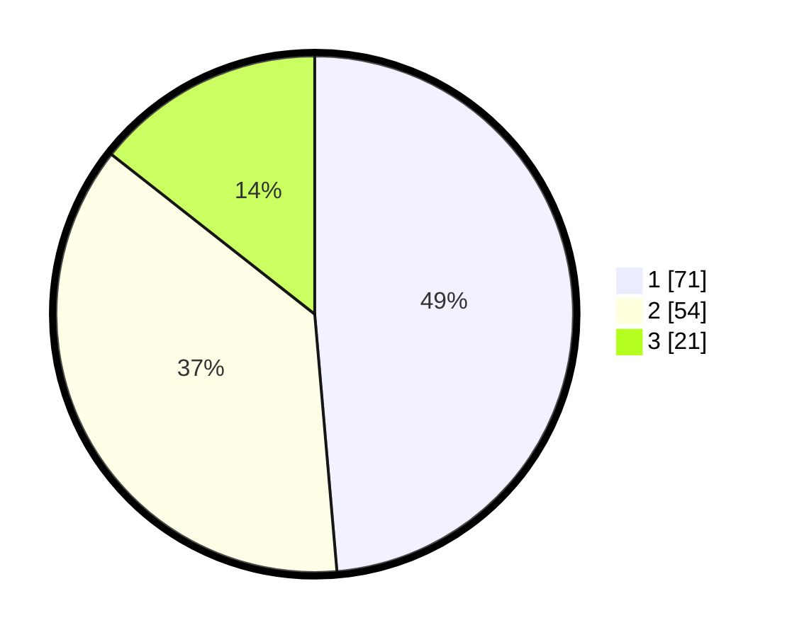

# Hasil

## Grafik

## Tabel

| No. | Nama Paslon    | Suara | Suara (raw) | Persentase |
|:--- |:-------------- | -----:| -----------:| ----------:|
| 1   | ANIES MUHAIMIN | 71    | [71][p-1]   | 48,63      |
| 2   | PRABOWO GIBRAN | 54    | [54][p-2]   | 36,99      |
| 3   | GANJAR MAHFUD  | 21    | [21][p-3]   | 14,38      |

[p-1]: https://github.com/gigit-pemilu/pemilu-2024-11-aceh/blob/main/pilpres/hitung-suara/sub/11-aceh/sub/75-kota-subulussalam/sub/03-rundeng/sub/2017-panglima-saman/sub/002-tps/sub/paslon-1.txt
[p-2]: https://github.com/gigit-pemilu/pemilu-2024-11-aceh/blob/main/pilpres/hitung-suara/sub/11-aceh/sub/75-kota-subulussalam/sub/03-rundeng/sub/2017-panglima-saman/sub/002-tps/sub/paslon-2.txt
[p-3]: https://github.com/gigit-pemilu/pemilu-2024-11-aceh/blob/main/pilpres/hitung-suara/sub/11-aceh/sub/75-kota-subulussalam/sub/03-rundeng/sub/2017-panglima-saman/sub/002-tps/sub/paslon-3.txt

## Foto C Plano

https://sirekap-obj-formc.kpu.go.id/f22e/pemilu/ppwp/11/75/03/20/17/1175032017002-20240215-112417--581b621e-50cb-4f5a-b552-4a3e98cd98c4.jpg

https://sirekap-obj-formc.kpu.go.id/f22e/pemilu/ppwp/11/75/03/20/17/1175032017002-20240222-222808--2bee3acb-abc4-4272-8f51-25760a901483.jpg

https://sirekap-obj-formc.kpu.go.id/f22e/pemilu/ppwp/11/75/03/20/17/1175032017002-20240222-223047--ebb375ba-0bd8-4e89-9467-dfc9e0c5fbd2.jpg

## Metadata

| Key        | Value               |
| ---------- | ------------------- |
| Time Stamp | 2024-02-22 23:00:00 |

## DATA PEMILIH TETAP

Jumlah pemilih dalam DPT: **117**.
 * L: **64**.
 * P: **53**.

## DATA PENGGUNA HAK PILIH

Jumlah pengguna hak pilih dalam DPT: **112**.
 * L: **61**.
 * P: **51**.

Jumlah pengguna hak pilih dalam DPTb: **70**.
 * L: **244**.
 * P: **440**.

Jumlah pengguna hak pilih dalam DPK: **2**.
 * L: **2**.
 * P: **0**.

Jumlah pengguna hak pilih: **114**.
 * L: **63**.
 * P: **51**.

## JUMLAH SUARA SAH DAN TIDAK SAH

JUMLAH SELURUH SUARA SAH: **100**.

JUMLAH SUARA TIDAK SAH: **12**.

JUMLAH SELURUH SUARA SAH DAN SUARA TIDAK SAH: **112**.

