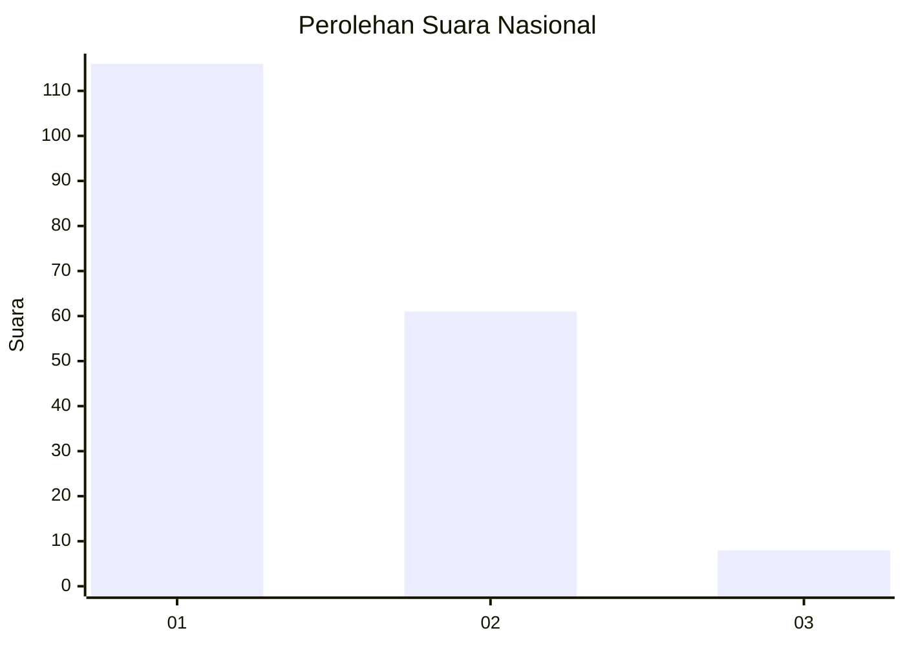
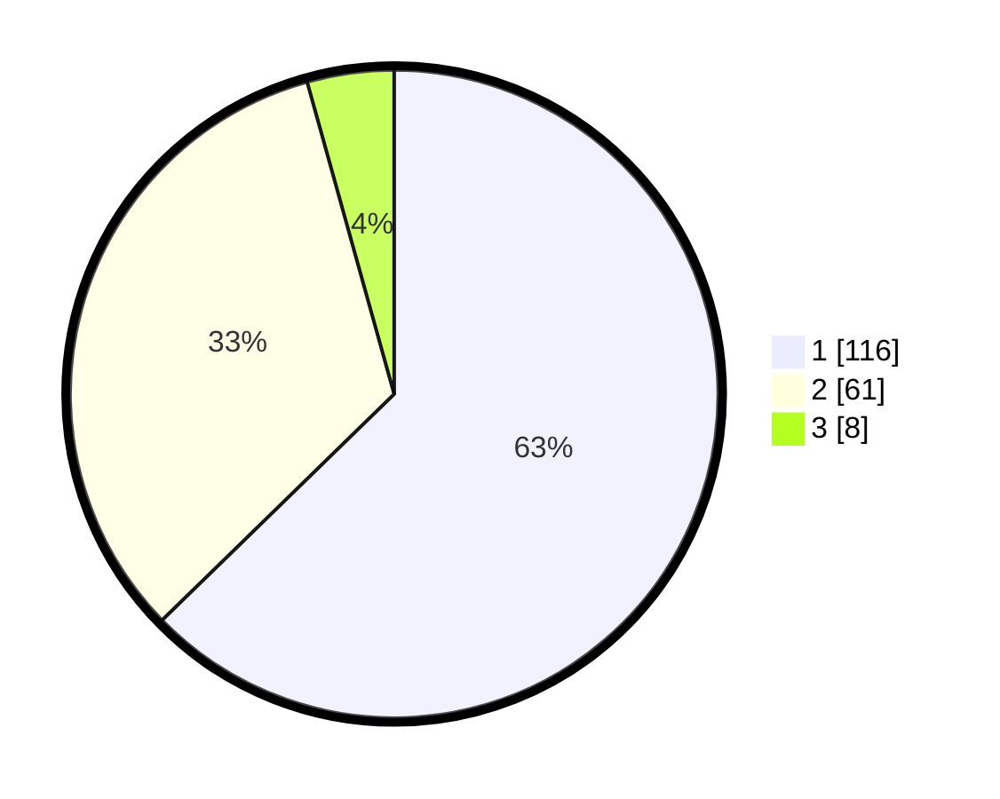

# Hasil

## Grafik

## Tabel

| No. | Nama Paslon    | Suara | Suara (raw) | Persentase |
|:--- |:-------------- | -----:| -----------:| ----------:|
| 1   | ANIES MUHAIMIN | 116   | [116][p-1]  | 62,70      |
| 2   | PRABOWO GIBRAN | 61    | [61][p-2]   | 32,97      |
| 3   | GANJAR MAHFUD  | 8     | [8][p-3]    | 4,32       |

[p-1]: https://github.com/gigit-pemilu/pemilu-2024/blob/main/pilpres/hitung-suara/sub/11-aceh/sub/75-kota-subulussalam/sub/03-rundeng/sub/2019-geruguh/sub/001-tps/sub/paslon-1.txt
[p-2]: https://github.com/gigit-pemilu/pemilu-2024/blob/main/pilpres/hitung-suara/sub/11-aceh/sub/75-kota-subulussalam/sub/03-rundeng/sub/2019-geruguh/sub/001-tps/sub/paslon-2.txt
[p-3]: https://github.com/gigit-pemilu/pemilu-2024/blob/main/pilpres/hitung-suara/sub/11-aceh/sub/75-kota-subulussalam/sub/03-rundeng/sub/2019-geruguh/sub/001-tps/sub/paslon-3.txt

## Foto C Plano

https://sirekap-obj-formc.kpu.go.id/ae8a/pemilu/ppwp/11/75/03/20/19/1175032019001-20240222-143310--54c4f8b3-24a7-4bd3-887f-c5975edb1806.jpg

https://sirekap-obj-formc.kpu.go.id/ae8a/pemilu/ppwp/11/75/03/20/19/1175032019001-20240222-143422--0926d75e-475f-44f0-8c69-e1ae96531438.jpg

https://sirekap-obj-formc.kpu.go.id/ae8a/pemilu/ppwp/11/75/03/20/19/1175032019001-20240222-143519--8c0606a0-4691-42aa-b763-97605637811a.jpg

## Metadata

| Key        | Value               |
| ---------- | ------------------- |
| Time Stamp | 2024-02-22 15:00:00 |

## DATA PEMILIH TETAP

Jumlah pemilih dalam DPT: **799**.
 * L: **104**.
 * P: **95**.

## DATA PENGGUNA HAK PILIH

Jumlah pengguna hak pilih dalam DPT: **786**.
 * L: **43**.
 * P: **43**.

Jumlah pengguna hak pilih dalam DPTb: **2**.
 * L: **1**.
 * P: **7**.

Jumlah pengguna hak pilih dalam DPK: **2**.
 * L: **7**.
 * P: **7**.

Jumlah pengguna hak pilih: **190**.
 * L: **95**.
 * P: **95**.

## JUMLAH SUARA SAH DAN TIDAK SAH

JUMLAH SELURUH SUARA SAH: **155**.

JUMLAH SUARA TIDAK SAH: **5**.

JUMLAH SELURUH SUARA SAH DAN SUARA TIDAK SAH: **190**.

