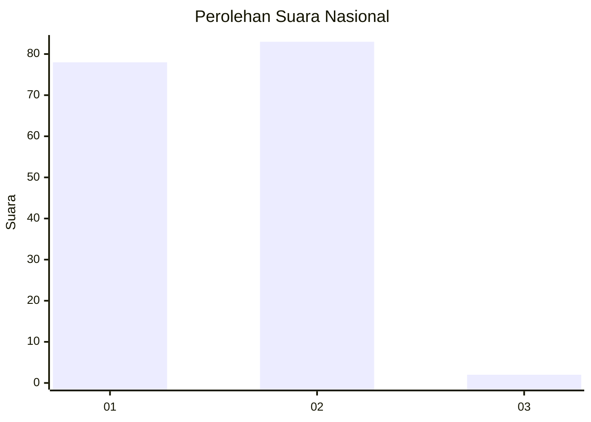
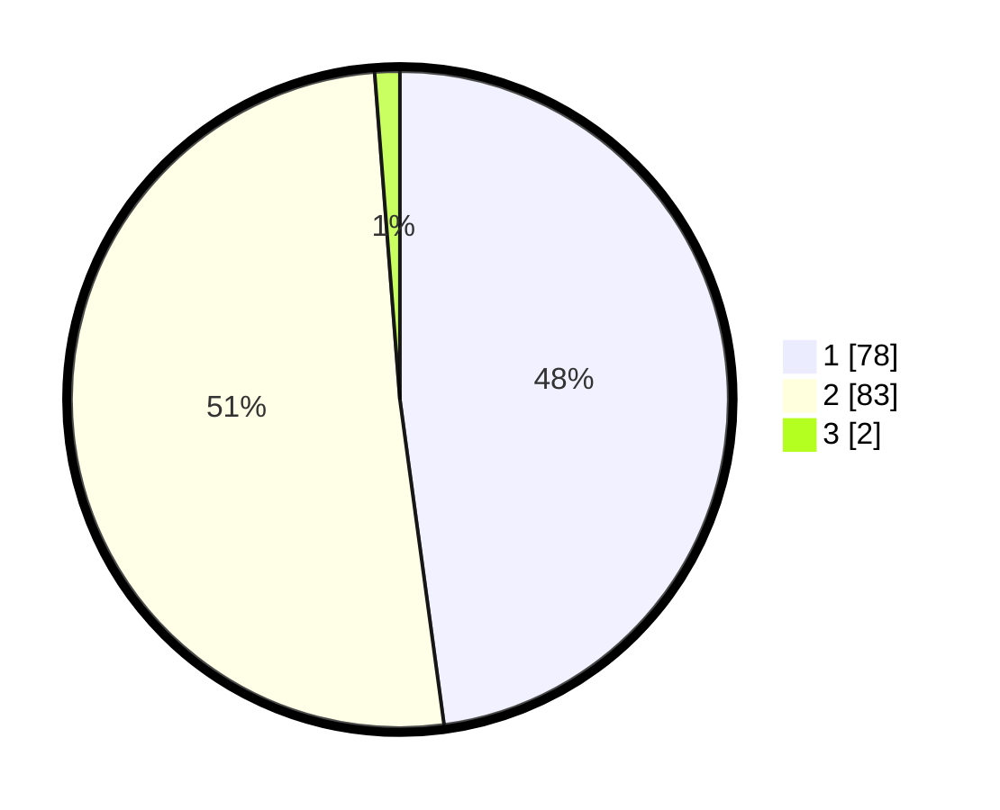

# Hasil

## Grafik

## Tabel

| No. | Nama Paslon    | Suara | Suara (raw) | Persentase |
|:--- |:-------------- | -----:| -----------:| ----------:|
| 1   | ANIES MUHAIMIN | 78    | [78][p-1]   | 47,85      |
| 2   | PRABOWO GIBRAN | 83    | [83][p-2]   | 50,92      |
| 3   | GANJAR MAHFUD  | 2     | [2][p-3]    | 1,23       |

[p-1]: https://github.com/gigit-pemilu/pemilu-2024/blob/main/pilpres/hitung-suara/sub/11-aceh/sub/75-kota-subulussalam/sub/03-rundeng/sub/2021-tualang/sub/001-tps/sub/paslon-1.txt
[p-2]: https://github.com/gigit-pemilu/pemilu-2024/blob/main/pilpres/hitung-suara/sub/11-aceh/sub/75-kota-subulussalam/sub/03-rundeng/sub/2021-tualang/sub/001-tps/sub/paslon-2.txt
[p-3]: https://github.com/gigit-pemilu/pemilu-2024/blob/main/pilpres/hitung-suara/sub/11-aceh/sub/75-kota-subulussalam/sub/03-rundeng/sub/2021-tualang/sub/001-tps/sub/paslon-3.txt

## Foto C Plano

https://sirekap-obj-formc.kpu.go.id/a187/pemilu/ppwp/11/75/03/20/21/1175032021001-20240215-025131--f540c9c3-d486-44da-9a14-9b60862ed605.jpg

https://sirekap-obj-formc.kpu.go.id/a187/pemilu/ppwp/11/75/03/20/21/1175032021001-20240215-024701--6e7fe9bf-a17c-4e99-b94e-76784207d89b.jpg

https://sirekap-obj-formc.kpu.go.id/a187/pemilu/ppwp/11/75/03/20/21/1175032021001-20240215-024909--0d18fe70-5bec-4779-8c15-7bc9fdce23f4.jpg

## Metadata

| Key        | Value               |
| ---------- | ------------------- |
| Time Stamp | 2024-02-16 00:00:26 |

