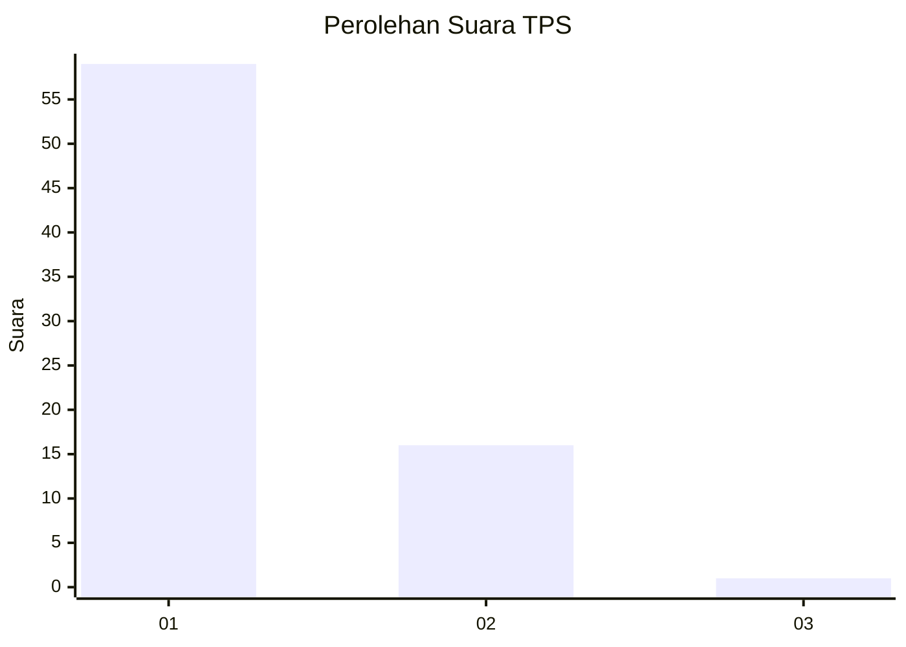
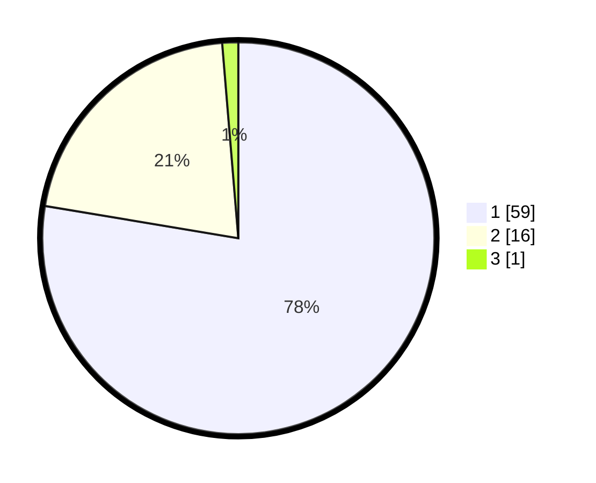

# Hasil

## Grafik

## Tabel

| No. | Nama Paslon    | Suara | Suara (raw) | Persentase |
|:--- |:-------------- | -----:| -----------:| ----------:|
| 1   | ANIES MUHAIMIN | 59    | [59][p-1]   | 77,63      |
| 2   | PRABOWO GIBRAN | 16    | [16][p-2]   | 21,05      |
| 3   | GANJAR MAHFUD  | 1     | [1][p-3]    | 1,32       |

[p-1]: https://github.com/gigit-pemilu/pemilu-2024-11-aceh/blob/main/pilpres/hitung-suara/sub/11-aceh/sub/75-kota-subulussalam/sub/03-rundeng/sub/2022-kuala-kepeng/sub/002-tps/sub/paslon-1.txt
[p-2]: https://github.com/gigit-pemilu/pemilu-2024-11-aceh/blob/main/pilpres/hitung-suara/sub/11-aceh/sub/75-kota-subulussalam/sub/03-rundeng/sub/2022-kuala-kepeng/sub/002-tps/sub/paslon-2.txt
[p-3]: https://github.com/gigit-pemilu/pemilu-2024-11-aceh/blob/main/pilpres/hitung-suara/sub/11-aceh/sub/75-kota-subulussalam/sub/03-rundeng/sub/2022-kuala-kepeng/sub/002-tps/sub/paslon-3.txt

## Foto C Plano

https://sirekap-obj-formc.kpu.go.id/3342/pemilu/ppwp/11/75/03/20/22/1175032022002-20240222-105949--7bd382a4-ea0a-441a-b7ba-b0aaef9d5b63.jpg

https://sirekap-obj-formc.kpu.go.id/3342/pemilu/ppwp/11/75/03/20/22/1175032022002-20240222-110044--5d63a9e4-b807-40c0-bfe7-e03affab2036.jpg

https://sirekap-obj-formc.kpu.go.id/3342/pemilu/ppwp/11/75/03/20/22/1175032022002-20240222-110134--a4cafc7e-f7c8-4544-84d0-999d63ab7438.jpg

## Metadata

| Key        | Value               |
| ---------- | ------------------- |
| Time Stamp | 2024-02-22 12:00:00 |

## DATA PEMILIH TETAP

Jumlah pemilih dalam DPT: **82**.
 * L: **39**.
 * P: **43**.

## DATA PENGGUNA HAK PILIH

Jumlah pengguna hak pilih dalam DPT: **78**.
 * L: **35**.
 * P: **41**.

Jumlah pengguna hak pilih dalam DPTb: **2**.
 * L: **1**.
 * P: **1**.

Jumlah pengguna hak pilih dalam DPK: **0**.
 * L: **0**.
 * P: **0**.

Jumlah pengguna hak pilih: **78**.
 * L: **36**.
 * P: **42**.

## JUMLAH SUARA SAH DAN TIDAK SAH

JUMLAH SELURUH SUARA SAH: **76**.

JUMLAH SUARA TIDAK SAH: **2**.

JUMLAH SELURUH SUARA SAH DAN SUARA TIDAK SAH: **78**.

