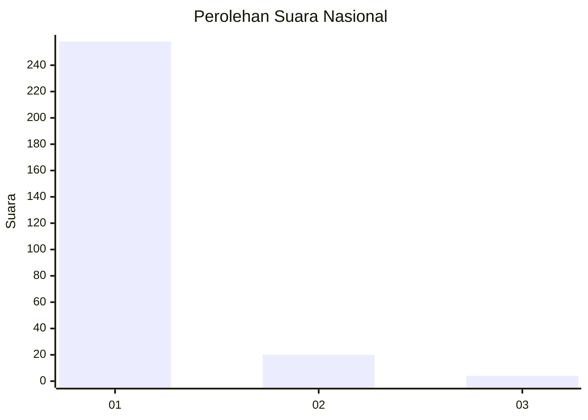
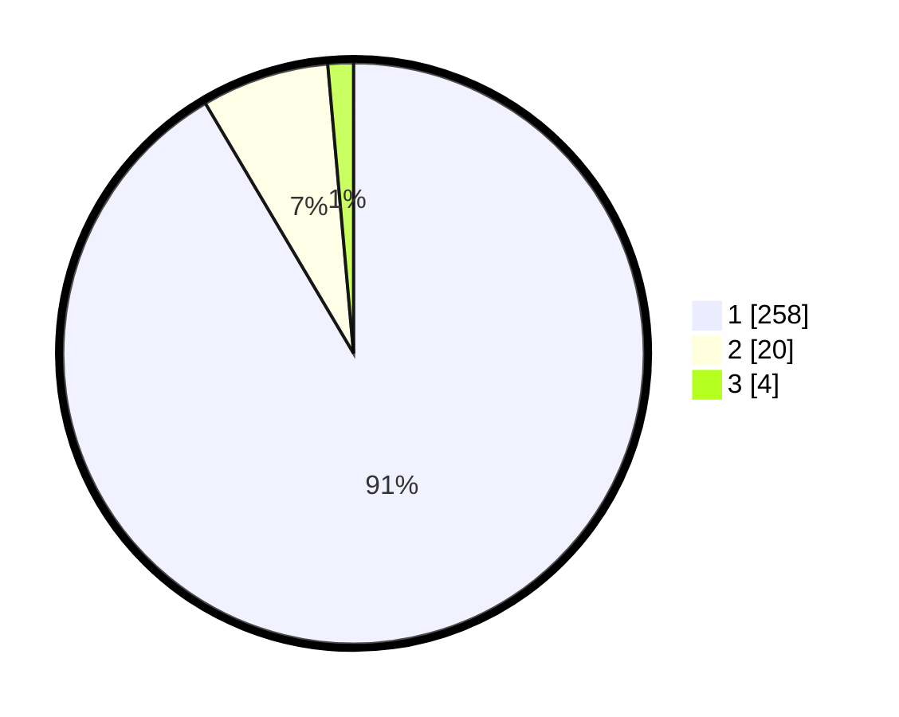

# Hasil

## Grafik

## Tabel

| No. | Nama Paslon    | Suara | Suara (raw) | Persentase |
|:--- |:-------------- | -----:| -----------:| ----------:|
| 1   | ANIES MUHAIMIN | 258   | [258][p-1]  | 91,49      |
| 2   | PRABOWO GIBRAN | 20    | [20][p-2]   | 7,09       |
| 3   | GANJAR MAHFUD  | 4     | [4][p-3]    | 1,42       |

[p-1]: https://github.com/gigit-pemilu/pemilu-2024/blob/main/pilpres/hitung-suara/sub/11-aceh/sub/75-kota-subulussalam/sub/04-sultan-daulat/sub/2002-bawan/sub/001-tps/sub/paslon-1.txt
[p-2]: https://github.com/gigit-pemilu/pemilu-2024/blob/main/pilpres/hitung-suara/sub/11-aceh/sub/75-kota-subulussalam/sub/04-sultan-daulat/sub/2002-bawan/sub/001-tps/sub/paslon-2.txt
[p-3]: https://github.com/gigit-pemilu/pemilu-2024/blob/main/pilpres/hitung-suara/sub/11-aceh/sub/75-kota-subulussalam/sub/04-sultan-daulat/sub/2002-bawan/sub/001-tps/sub/paslon-3.txt

## Foto C Plano

https://sirekap-obj-formc.kpu.go.id/d6bd/pemilu/ppwp/11/75/04/20/02/1175042002001-20240222-170933--9f293209-5feb-4a5d-8c2e-9980906e1d29.jpg

https://sirekap-obj-formc.kpu.go.id/d6bd/pemilu/ppwp/11/75/04/20/02/1175042002001-20240222-171410--3b2655f6-ade2-4824-a3b5-4e26bfe3019b.jpg

https://sirekap-obj-formc.kpu.go.id/d6bd/pemilu/ppwp/11/75/04/20/02/1175042002001-20240222-171657--8d609e59-a0b1-43e7-a91f-13ad49e0d5e5.jpg

## Metadata

| Key        | Value               |
| ---------- | ------------------- |
| Time Stamp | 2024-02-22 18:00:00 |

## DATA PEMILIH TETAP

Jumlah pemilih dalam DPT: **193**.
 * L: **102**.
 * P: **91**.

## DATA PENGGUNA HAK PILIH

Jumlah pengguna hak pilih dalam DPT: **179**.
 * L: **93**.
 * P: **86**.

Jumlah pengguna hak pilih dalam DPTb: **4**.
 * L: **3**.
 * P: **5**.

Jumlah pengguna hak pilih dalam DPK: **1**.
 * L: **0**.
 * P: **1**.

Jumlah pengguna hak pilih: **384**.
 * L: **96**.
 * P: **88**.

## JUMLAH SUARA SAH DAN TIDAK SAH

JUMLAH SELURUH SUARA SAH: **182**.

JUMLAH SUARA TIDAK SAH: **2**.

JUMLAH SELURUH SUARA SAH DAN SUARA TIDAK SAH: **184**.

