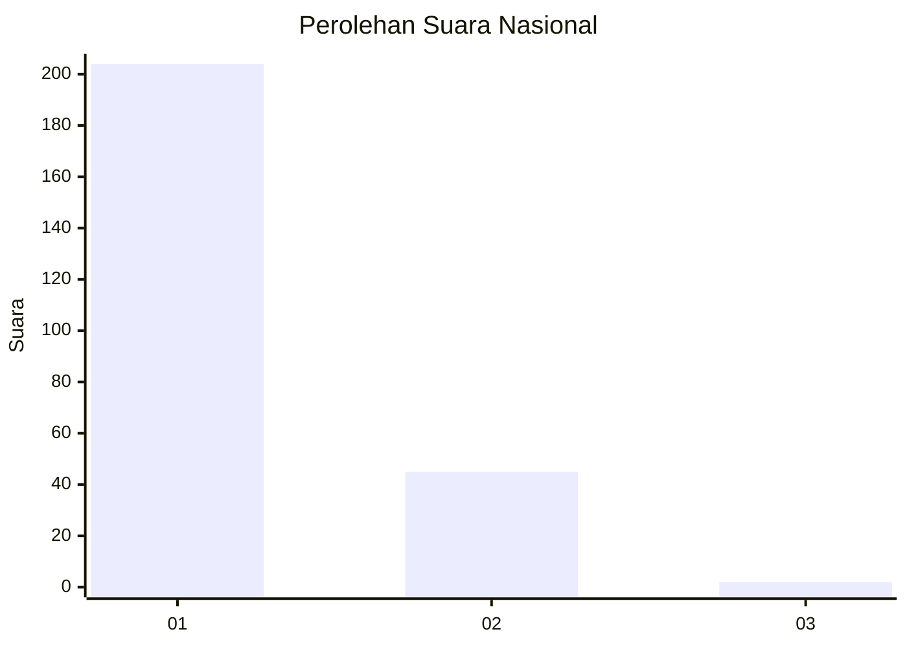
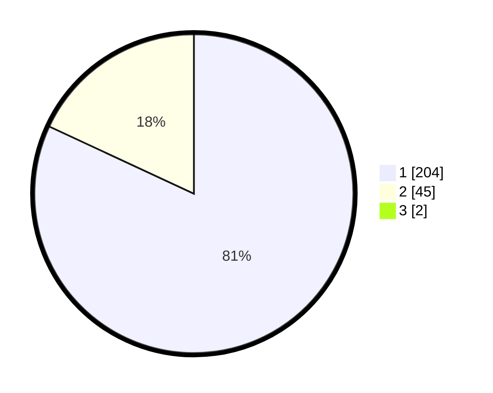

# Hasil

## Grafik

## Tabel

| No. | Nama Paslon    | Suara | Suara (raw) | Persentase |
|:--- |:-------------- | -----:| -----------:| ----------:|
| 1   | ANIES MUHAIMIN | 204   | [204][p-1]  | 81,27      |
| 2   | PRABOWO GIBRAN | 45    | [45][p-2]   | 17,93      |
| 3   | GANJAR MAHFUD  | 2     | [2][p-3]    | 0,80       |

[p-1]: https://github.com/gigit-pemilu/pemilu-2024/blob/main/pilpres/hitung-suara/sub/11-aceh/sub/75-kota-subulussalam/sub/04-sultan-daulat/sub/2003-sigrun/sub/001-tps/sub/paslon-1.txt
[p-2]: https://github.com/gigit-pemilu/pemilu-2024/blob/main/pilpres/hitung-suara/sub/11-aceh/sub/75-kota-subulussalam/sub/04-sultan-daulat/sub/2003-sigrun/sub/001-tps/sub/paslon-2.txt
[p-3]: https://github.com/gigit-pemilu/pemilu-2024/blob/main/pilpres/hitung-suara/sub/11-aceh/sub/75-kota-subulussalam/sub/04-sultan-daulat/sub/2003-sigrun/sub/001-tps/sub/paslon-3.txt

## Foto C Plano

https://sirekap-obj-formc.kpu.go.id/ee6a/pemilu/ppwp/11/75/04/20/03/1175042003001-20240222-205259--cb7dd5e3-596c-408f-83b9-90499b67ed9f.jpg

https://sirekap-obj-formc.kpu.go.id/ee6a/pemilu/ppwp/11/75/04/20/03/1175042003001-20240222-205431--62d1a144-7b9a-41ab-8977-acefbb988dfd.jpg

https://sirekap-obj-formc.kpu.go.id/ee6a/pemilu/ppwp/11/75/04/20/03/1175042003001-20240222-205522--6c47eb15-03d6-47e2-85c2-944835766dbe.jpg

## Metadata

| Key        | Value               |
| ---------- | ------------------- |
| Time Stamp | 2024-02-22 21:00:00 |

## DATA PEMILIH TETAP

Jumlah pemilih dalam DPT: **55**.
 * L: **20**.
 * P: **0**.

## DATA PENGGUNA HAK PILIH

Jumlah pengguna hak pilih dalam DPT: **205**.
 * L: **100**.
 * P: **25**.

Jumlah pengguna hak pilih dalam DPTb: **0**.
 * L: **0**.
 * P: **0**.

Jumlah pengguna hak pilih dalam DPK: **0**.
 * L: **0**.
 * P: **55**.

Jumlah pengguna hak pilih: **552**.
 * L: **222**.
 * P: **52**.

## JUMLAH SUARA SAH DAN TIDAK SAH

JUMLAH SELURUH SUARA SAH: **251**.

JUMLAH SUARA TIDAK SAH: **12**.

JUMLAH SELURUH SUARA SAH DAN SUARA TIDAK SAH: **263**.

