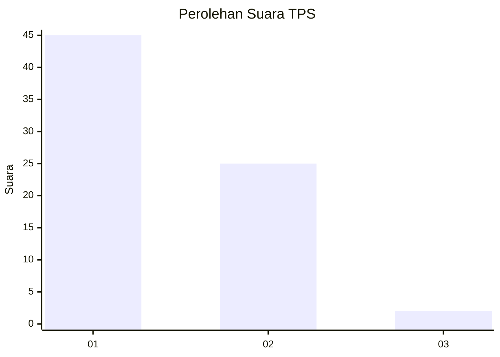
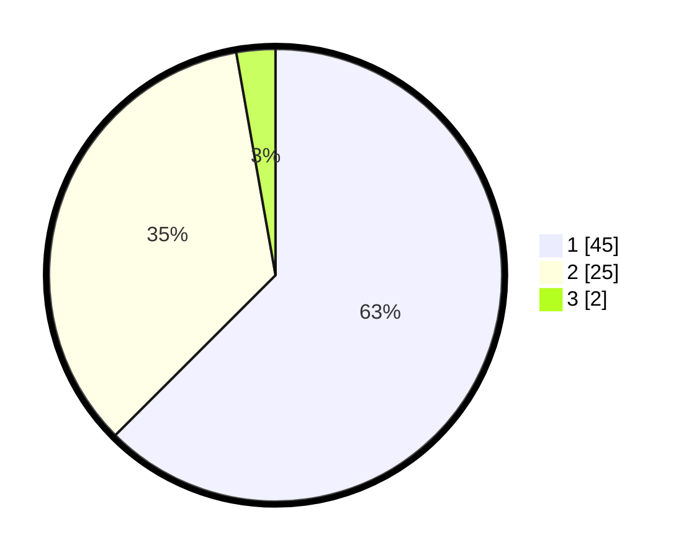

# Hasil

## Grafik

## Tabel

| No. | Nama Paslon    | Suara | Suara (raw) | Persentase |
|:--- |:-------------- | -----:| -----------:| ----------:|
| 1   | ANIES MUHAIMIN | 45    | [45][p-1]   | 62,50      |
| 2   | PRABOWO GIBRAN | 25    | [25][p-2]   | 34,72      |
| 3   | GANJAR MAHFUD  | 2     | [2][p-3]    | 2,78       |

[p-1]: https://github.com/gigit-pemilu/pemilu-2024-11-aceh/blob/main/pilpres/hitung-suara/sub/11-aceh/sub/75-kota-subulussalam/sub/04-sultan-daulat/sub/2003-sigrun/sub/002-tps/sub/paslon-1.txt
[p-2]: https://github.com/gigit-pemilu/pemilu-2024-11-aceh/blob/main/pilpres/hitung-suara/sub/11-aceh/sub/75-kota-subulussalam/sub/04-sultan-daulat/sub/2003-sigrun/sub/002-tps/sub/paslon-2.txt
[p-3]: https://github.com/gigit-pemilu/pemilu-2024-11-aceh/blob/main/pilpres/hitung-suara/sub/11-aceh/sub/75-kota-subulussalam/sub/04-sultan-daulat/sub/2003-sigrun/sub/002-tps/sub/paslon-3.txt

## Foto C Plano

https://sirekap-obj-formc.kpu.go.id/fa30/pemilu/ppwp/11/75/04/20/03/1175042003002-20240222-214122--562f35b7-b0ef-4616-aa52-ea20849b1a81.jpg

https://sirekap-obj-formc.kpu.go.id/fa30/pemilu/ppwp/11/75/04/20/03/1175042003002-20240222-214443--27ac07a2-95cc-463b-bb90-4273b3613897.jpg

https://sirekap-obj-formc.kpu.go.id/fa30/pemilu/ppwp/11/75/04/20/03/1175042003002-20240222-214707--7e71d8ed-4a70-4c9d-ad4c-ad89d3829736.jpg

## Metadata

| Key        | Value               |
| ---------- | ------------------- |
| Time Stamp | 2024-02-22 22:00:00 |

## DATA PEMILIH TETAP

Jumlah pemilih dalam DPT: **130**.
 * L: **86**.
 * P: **94**.

## DATA PENGGUNA HAK PILIH

Jumlah pengguna hak pilih dalam DPT: **577**.
 * L: **34**.
 * P: **93**.

Jumlah pengguna hak pilih dalam DPTb: **0**.
 * L: **0**.
 * P: **0**.

Jumlah pengguna hak pilih dalam DPK: **9**.
 * L: **4**.
 * P: **0**.

Jumlah pengguna hak pilih: **181**.
 * L: **93**.
 * P: **23**.

## JUMLAH SUARA SAH DAN TIDAK SAH

JUMLAH SELURUH SUARA SAH: **172**.

JUMLAH SUARA TIDAK SAH: **9**.

JUMLAH SELURUH SUARA SAH DAN SUARA TIDAK SAH: **181**.

