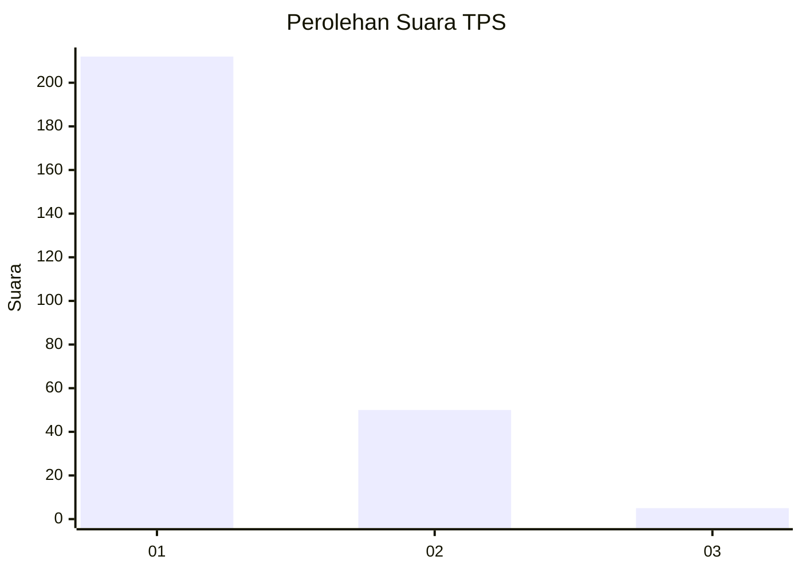
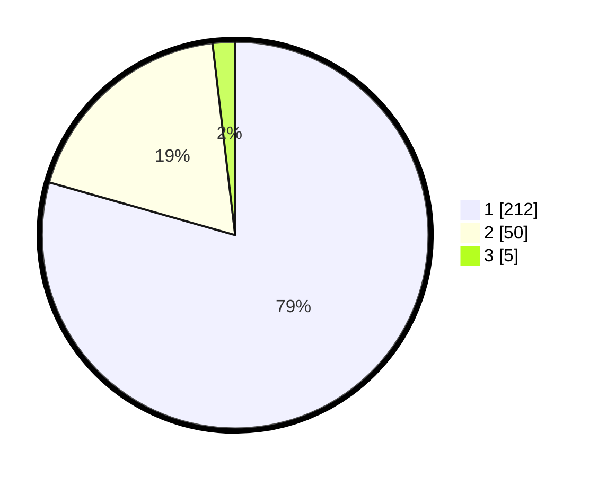

# Hasil

## Grafik

## Tabel

| No. | Nama Paslon    | Suara | Suara (raw) | Persentase |
|:--- |:-------------- | -----:| -----------:| ----------:|
| 1   | ANIES MUHAIMIN | 212   | [212][p-1]  | 79,40      |
| 2   | PRABOWO GIBRAN | 50    | [50][p-2]   | 18,73      |
| 3   | GANJAR MAHFUD  | 5     | [5][p-3]    | 1,87       |

[p-1]: https://github.com/gigit-pemilu/pemilu-2024-11-aceh/blob/main/pilpres/hitung-suara/sub/11-aceh/sub/75-kota-subulussalam/sub/04-sultan-daulat/sub/2003-sigrun/sub/003-tps/sub/paslon-1.txt
[p-2]: https://github.com/gigit-pemilu/pemilu-2024-11-aceh/blob/main/pilpres/hitung-suara/sub/11-aceh/sub/75-kota-subulussalam/sub/04-sultan-daulat/sub/2003-sigrun/sub/003-tps/sub/paslon-2.txt
[p-3]: https://github.com/gigit-pemilu/pemilu-2024-11-aceh/blob/main/pilpres/hitung-suara/sub/11-aceh/sub/75-kota-subulussalam/sub/04-sultan-daulat/sub/2003-sigrun/sub/003-tps/sub/paslon-3.txt

## Foto C Plano

https://sirekap-obj-formc.kpu.go.id/2d93/pemilu/ppwp/11/75/04/20/03/1175042003003-20240222-223346--76bc659c-1485-47bd-b047-8eb6d29c4e4a.jpg

https://sirekap-obj-formc.kpu.go.id/2d93/pemilu/ppwp/11/75/04/20/03/1175042003003-20240222-223520--5eb999e6-c1d3-4932-9aaa-1c8812ecdeed.jpg

https://sirekap-obj-formc.kpu.go.id/2d93/pemilu/ppwp/11/75/04/20/03/1175042003003-20240222-223813--5732be4b-4f4c-4ee9-a1dd-7590b3bd9523.jpg

## Metadata

| Key        | Value               |
| ---------- | ------------------- |
| Time Stamp | 2024-02-22 23:00:00 |

## DATA PEMILIH TETAP

Jumlah pemilih dalam DPT: **286**.
 * L: **144**.
 * P: **142**.

## DATA PENGGUNA HAK PILIH

Jumlah pengguna hak pilih dalam DPT: **276**.
 * L: **107**.
 * P: **139**.

Jumlah pengguna hak pilih dalam DPTb: **0**.
 * L: **0**.
 * P: **0**.

Jumlah pengguna hak pilih dalam DPK: **3**.
 * L: **0**.
 * P: **3**.

Jumlah pengguna hak pilih: **279**.
 * L: **137**.
 * P: **142**.

## JUMLAH SUARA SAH DAN TIDAK SAH

JUMLAH SELURUH SUARA SAH: **267**.

JUMLAH SUARA TIDAK SAH: **3**.

JUMLAH SELURUH SUARA SAH DAN SUARA TIDAK SAH: **276**.

