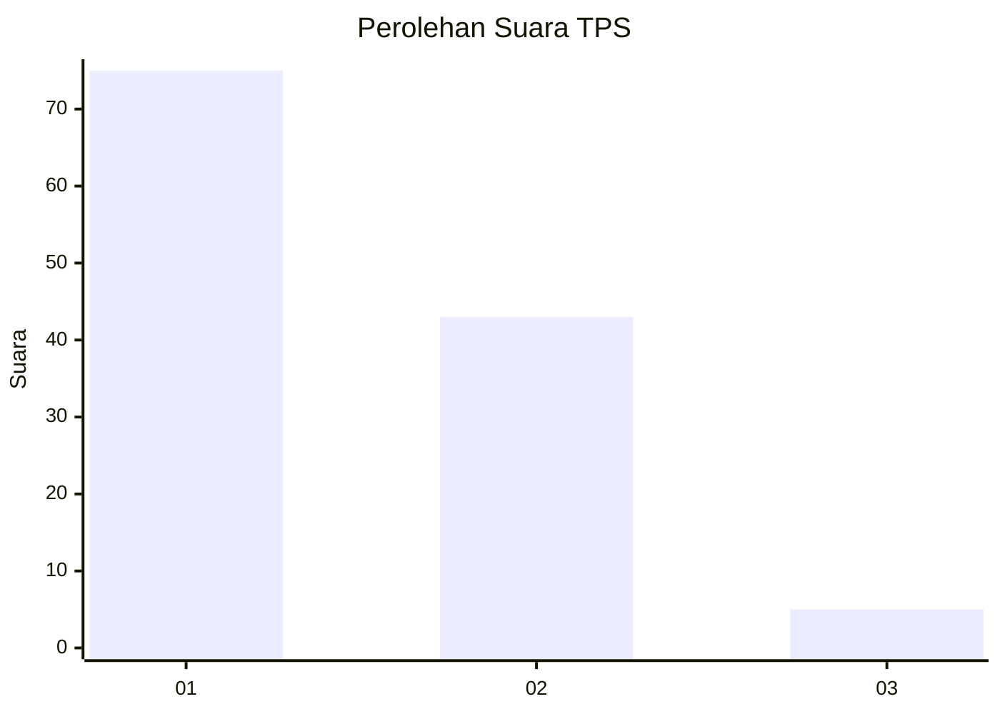
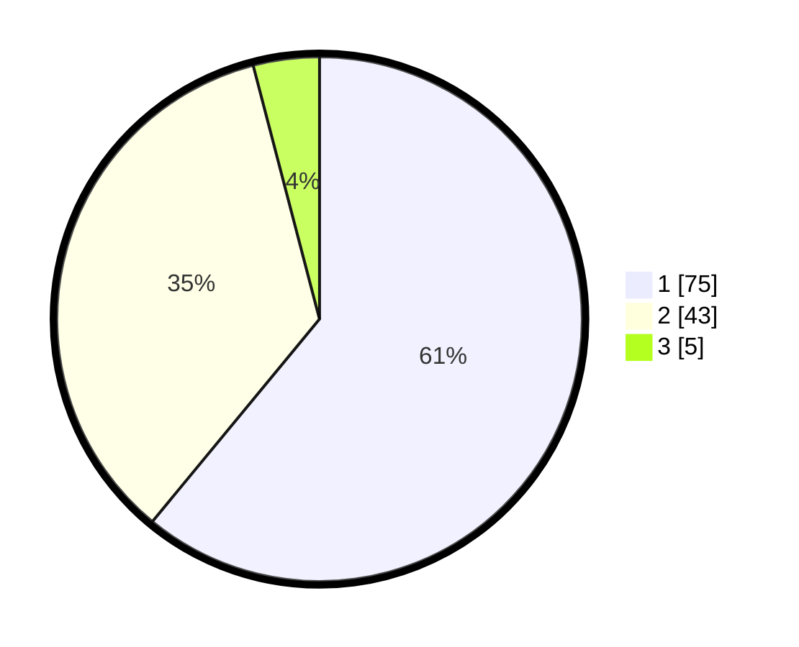

# Hasil

## Grafik

## Tabel

| No. | Nama Paslon    | Suara | Suara (raw) | Persentase |
|:--- |:-------------- | -----:| -----------:| ----------:|
| 1   | ANIES MUHAIMIN | 75    | [75][p-1]   | 60,98      |
| 2   | PRABOWO GIBRAN | 43    | [43][p-2]   | 34,96      |
| 3   | GANJAR MAHFUD  | 5     | [5][p-3]    | 4,07       |

[p-1]: https://github.com/gigit-pemilu/pemilu-2024-11-aceh/blob/main/pilpres/hitung-suara/sub/11-aceh/sub/75-kota-subulussalam/sub/04-sultan-daulat/sub/2004-jabi-jabi/sub/003-tps/sub/paslon-1.txt
[p-2]: https://github.com/gigit-pemilu/pemilu-2024-11-aceh/blob/main/pilpres/hitung-suara/sub/11-aceh/sub/75-kota-subulussalam/sub/04-sultan-daulat/sub/2004-jabi-jabi/sub/003-tps/sub/paslon-2.txt
[p-3]: https://github.com/gigit-pemilu/pemilu-2024-11-aceh/blob/main/pilpres/hitung-suara/sub/11-aceh/sub/75-kota-subulussalam/sub/04-sultan-daulat/sub/2004-jabi-jabi/sub/003-tps/sub/paslon-3.txt

## Foto C Plano

https://sirekap-obj-formc.kpu.go.id/ddd6/pemilu/ppwp/11/75/04/20/04/1175042004003-20240219-224358--5dea9967-d79d-4d76-b597-7f1fef64ad84.jpg

https://sirekap-obj-formc.kpu.go.id/ddd6/pemilu/ppwp/11/75/04/20/04/1175042004003-20240219-224529--d6c42cd8-9568-4733-8ff5-aa5443ca5be2.jpg

https://sirekap-obj-formc.kpu.go.id/ddd6/pemilu/ppwp/11/75/04/20/04/1175042004003-20240219-224654--cd9a1dab-343b-4304-aec9-48c796e9f45a.jpg

## Metadata

| Key        | Value               |
| ---------- | ------------------- |
| Time Stamp | 2024-02-19 23:00:00 |

## DATA PEMILIH TETAP

Jumlah pemilih dalam DPT: **296**.
 * L: **111**.
 * P: **95**.

## DATA PENGGUNA HAK PILIH

Jumlah pengguna hak pilih dalam DPT: **197**.
 * L: **305**.
 * P: **92**.

Jumlah pengguna hak pilih dalam DPTb: **882**.
 * L: **81**.
 * P: **805**.

Jumlah pengguna hak pilih dalam DPK: **1**.
 * L: **1**.
 * P: **600**.

Jumlah pengguna hak pilih: **202**.
 * L: **107**.
 * P: **93**.

## JUMLAH SUARA SAH DAN TIDAK SAH

JUMLAH SELURUH SUARA SAH: **123**.

JUMLAH SUARA TIDAK SAH: **317**.

JUMLAH SELURUH SUARA SAH DAN SUARA TIDAK SAH: **270**.

