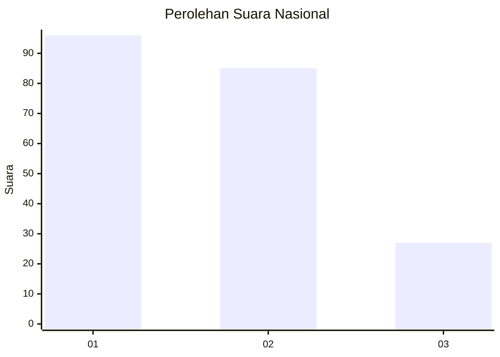
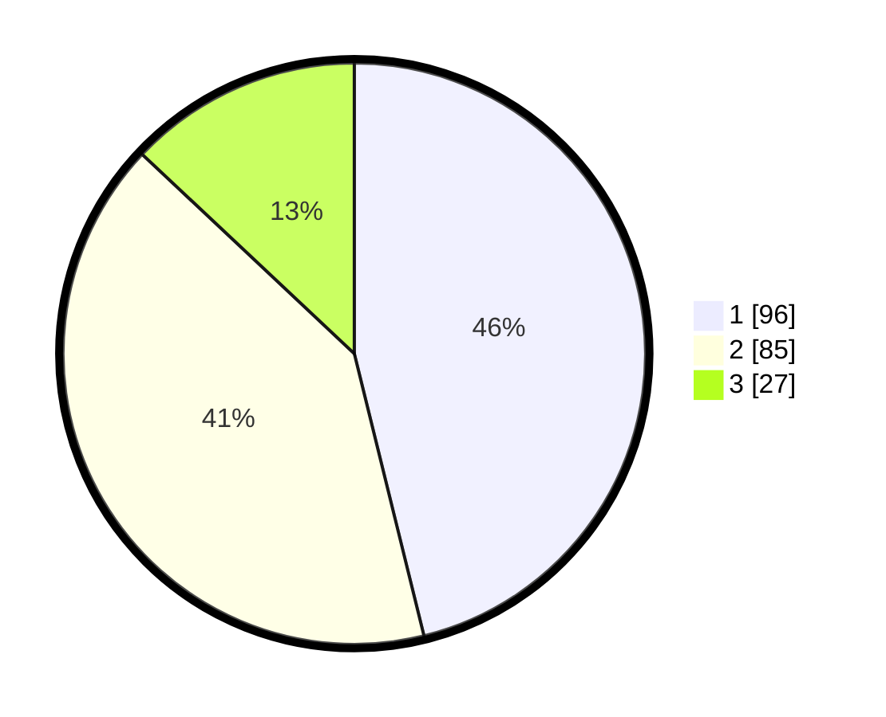

# Hasil

## Grafik

## Tabel

| No. | Nama Paslon    | Suara | Suara (raw) | Persentase |
|:--- |:-------------- | -----:| -----------:| ----------:|
| 1   | ANIES MUHAIMIN | 96    | [96][p-1]   | 46,15      |
| 2   | PRABOWO GIBRAN | 85    | [85][p-2]   | 40,87      |
| 3   | GANJAR MAHFUD  | 27    | [27][p-3]   | 12,98      |

[p-1]: https://github.com/gigit-pemilu/pemilu-2024/blob/main/pilpres/hitung-suara/sub/11-aceh/sub/75-kota-subulussalam/sub/04-sultan-daulat/sub/2006-lae-langge/sub/003-tps/sub/paslon-1.txt
[p-2]: https://github.com/gigit-pemilu/pemilu-2024/blob/main/pilpres/hitung-suara/sub/11-aceh/sub/75-kota-subulussalam/sub/04-sultan-daulat/sub/2006-lae-langge/sub/003-tps/sub/paslon-2.txt
[p-3]: https://github.com/gigit-pemilu/pemilu-2024/blob/main/pilpres/hitung-suara/sub/11-aceh/sub/75-kota-subulussalam/sub/04-sultan-daulat/sub/2006-lae-langge/sub/003-tps/sub/paslon-3.txt

## Foto C Plano

https://sirekap-obj-formc.kpu.go.id/ba43/pemilu/ppwp/11/75/04/20/06/1175042006003-20240222-112704--1d7c0b03-ad33-4e52-8198-8143984c0ede.jpg

https://sirekap-obj-formc.kpu.go.id/ba43/pemilu/ppwp/11/75/04/20/06/1175042006003-20240222-112803--0941bc14-ac67-486b-a60c-6853287d4564.jpg

https://sirekap-obj-formc.kpu.go.id/ba43/pemilu/ppwp/11/75/04/20/06/1175042006003-20240222-112853--d6281d02-cf1f-4234-ac07-7c57af6b3084.jpg

## Metadata

| Key        | Value               |
| ---------- | ------------------- |
| Time Stamp | 2024-02-22 12:00:00 |

## DATA PEMILIH TETAP

Jumlah pemilih dalam DPT: **0**.
 * L: **0**.
 * P: **0**.

## DATA PENGGUNA HAK PILIH

Jumlah pengguna hak pilih dalam DPT: **0**.
 * L: **0**.
 * P: **0**.

Jumlah pengguna hak pilih dalam DPTb: **758**.
 * L: **555**.
 * P: **555**.

Jumlah pengguna hak pilih dalam DPK: **12**.
 * L: **777**.
 * P: **777**.

Jumlah pengguna hak pilih: **212**.
 * L: **111**.
 * P: **101**.

## JUMLAH SUARA SAH DAN TIDAK SAH

JUMLAH SELURUH SUARA SAH: **195**.

JUMLAH SUARA TIDAK SAH: **200**.

JUMLAH SELURUH SUARA SAH DAN SUARA TIDAK SAH: **5**.

