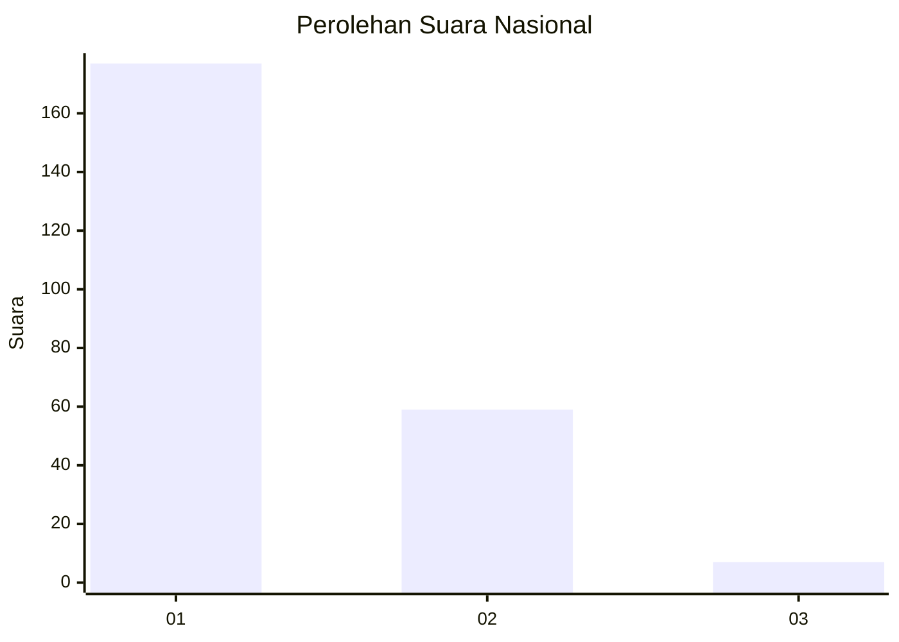
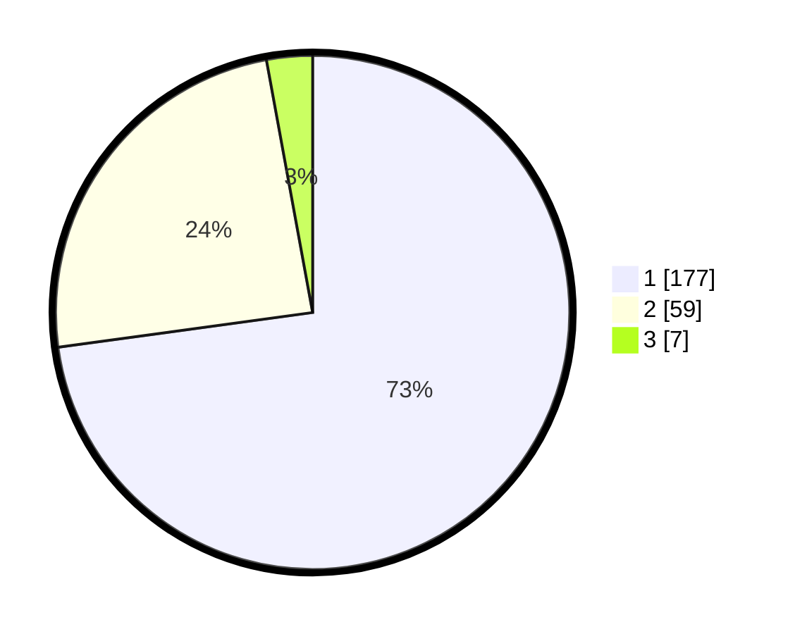

# Hasil

## Grafik

## Tabel

| No. | Nama Paslon    | Suara | Suara (raw) | Persentase |
|:--- |:-------------- | -----:| -----------:| ----------:|
| 1   | ANIES MUHAIMIN | 177   | [177][p-1]  | 72,84      |
| 2   | PRABOWO GIBRAN | 59    | [59][p-2]   | 24,28      |
| 3   | GANJAR MAHFUD  | 7     | [7][p-3]    | 2,88       |

[p-1]: https://github.com/gigit-pemilu/pemilu-2024/blob/main/pilpres/hitung-suara/sub/11-aceh/sub/75-kota-subulussalam/sub/04-sultan-daulat/sub/2008-gunung-bakti/sub/003-tps/sub/paslon-1.txt
[p-2]: https://github.com/gigit-pemilu/pemilu-2024/blob/main/pilpres/hitung-suara/sub/11-aceh/sub/75-kota-subulussalam/sub/04-sultan-daulat/sub/2008-gunung-bakti/sub/003-tps/sub/paslon-2.txt
[p-3]: https://github.com/gigit-pemilu/pemilu-2024/blob/main/pilpres/hitung-suara/sub/11-aceh/sub/75-kota-subulussalam/sub/04-sultan-daulat/sub/2008-gunung-bakti/sub/003-tps/sub/paslon-3.txt

## Foto C Plano

https://sirekap-obj-formc.kpu.go.id/76d4/pemilu/ppwp/11/75/04/20/08/1175042008003-20240220-114220--3d4669da-a412-467f-aa0f-9388ef127d20.jpg

https://sirekap-obj-formc.kpu.go.id/76d4/pemilu/ppwp/11/75/04/20/08/1175042008003-20240220-114302--115f8dcf-588d-4df6-a27a-7f8c888daf14.jpg

https://sirekap-obj-formc.kpu.go.id/76d4/pemilu/ppwp/11/75/04/20/08/1175042008003-20240220-114339--71bf5f0f-ebec-4d1e-9468-52034c7a7c0b.jpg

## Metadata

| Key        | Value               |
| ---------- | ------------------- |
| Time Stamp | 2024-02-20 12:00:00 |

## DATA PEMILIH TETAP

Jumlah pemilih dalam DPT: **0**.
 * L: **0**.
 * P: **0**.

## DATA PENGGUNA HAK PILIH

Jumlah pengguna hak pilih dalam DPT: **7**.
 * L: **0**.
 * P: **0**.

Jumlah pengguna hak pilih dalam DPTb: **777**.
 * L: **555**.
 * P: **555**.

Jumlah pengguna hak pilih dalam DPK: **777**.
 * L: **0**.
 * P: **577**.

Jumlah pengguna hak pilih: **777**.
 * L: **134**.
 * P: **126**.

## JUMLAH SUARA SAH DAN TIDAK SAH

JUMLAH SELURUH SUARA SAH: **243**.

JUMLAH SUARA TIDAK SAH: **17**.

JUMLAH SELURUH SUARA SAH DAN SUARA TIDAK SAH: **260**.

