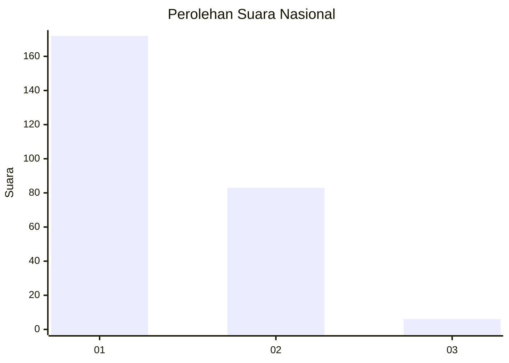
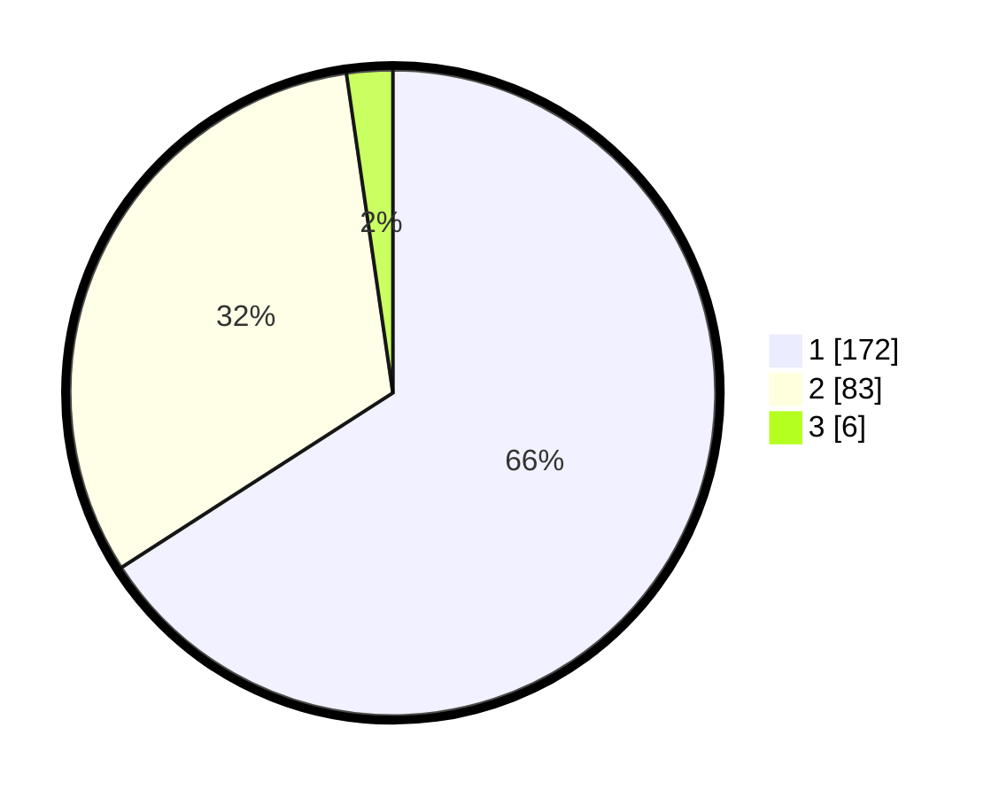

# Hasil

## Grafik

## Tabel

| No. | Nama Paslon    | Suara | Suara (raw) | Persentase |
|:--- |:-------------- | -----:| -----------:| ----------:|
| 1   | ANIES MUHAIMIN | 172   | [172][p-1]  | 65,90      |
| 2   | PRABOWO GIBRAN | 83    | [83][p-2]   | 31,80      |
| 3   | GANJAR MAHFUD  | 6     | [6][p-3]    | 2,30       |

[p-1]: https://github.com/gigit-pemilu/pemilu-2024/blob/main/pilpres/hitung-suara/sub/11-aceh/sub/75-kota-subulussalam/sub/04-sultan-daulat/sub/2010-pulo-kedep/sub/004-tps/sub/paslon-1.txt
[p-2]: https://github.com/gigit-pemilu/pemilu-2024/blob/main/pilpres/hitung-suara/sub/11-aceh/sub/75-kota-subulussalam/sub/04-sultan-daulat/sub/2010-pulo-kedep/sub/004-tps/sub/paslon-2.txt
[p-3]: https://github.com/gigit-pemilu/pemilu-2024/blob/main/pilpres/hitung-suara/sub/11-aceh/sub/75-kota-subulussalam/sub/04-sultan-daulat/sub/2010-pulo-kedep/sub/004-tps/sub/paslon-3.txt

## Foto C Plano

https://sirekap-obj-formc.kpu.go.id/5259/pemilu/ppwp/11/75/04/20/10/1175042010004-20240219-100042--f3c71517-25b2-48ac-94aa-cec62085304f.jpg

https://sirekap-obj-formc.kpu.go.id/5259/pemilu/ppwp/11/75/04/20/10/1175042010004-20240219-100224--af7e14e3-4b23-4aab-879a-5706d79fab07.jpg

https://sirekap-obj-formc.kpu.go.id/5259/pemilu/ppwp/11/75/04/20/10/1175042010004-20240219-100459--d39cb868-8d6d-443b-941e-f23f23ecd47d.jpg

## Metadata

| Key        | Value               |
| ---------- | ------------------- |
| Time Stamp | 2024-02-20 10:00:00 |

## DATA PEMILIH TETAP

Jumlah pemilih dalam DPT: **296**.
 * L: **153**.
 * P: **143**.

## DATA PENGGUNA HAK PILIH

Jumlah pengguna hak pilih dalam DPT: **279**.
 * L: **144**.
 * P: **135**.

Jumlah pengguna hak pilih dalam DPTb: **0**.
 * L: **0**.
 * P: **0**.

Jumlah pengguna hak pilih dalam DPK: **3**.
 * L: **5**.
 * P: **0**.

Jumlah pengguna hak pilih: **280**.
 * L: **149**.
 * P: **139**.

## JUMLAH SUARA SAH DAN TIDAK SAH

JUMLAH SELURUH SUARA SAH: **261**.

JUMLAH SUARA TIDAK SAH: **19**.

JUMLAH SELURUH SUARA SAH DAN SUARA TIDAK SAH: **280**.

