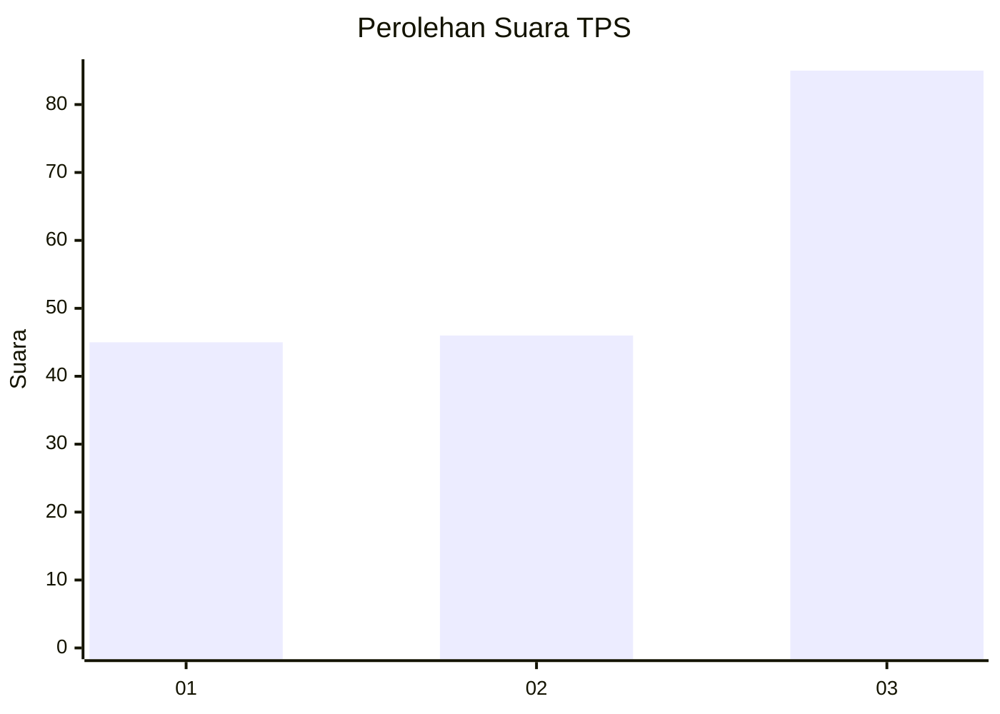
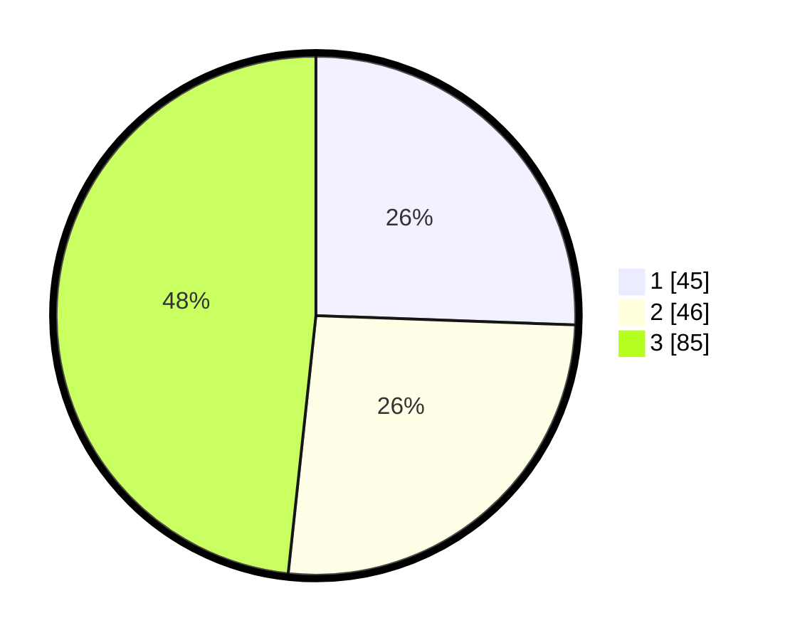

# Hasil

## Grafik

## Tabel

| No. | Nama Paslon    | Suara | Suara (raw) | Persentase |
|:--- |:-------------- | -----:| -----------:| ----------:|
| 1   | ANIES MUHAIMIN | 45    | [45][p-1]   | 25,57      |
| 2   | PRABOWO GIBRAN | 46    | [46][p-2]   | 26,14      |
| 3   | GANJAR MAHFUD  | 85    | [85][p-3]   | 48,30      |

[p-1]: https://github.com/gigit-pemilu/pemilu-2024-11-aceh/blob/main/pilpres/hitung-suara/sub/11-aceh/sub/75-kota-subulussalam/sub/04-sultan-daulat/sub/2012-singgersing/sub/002-tps/sub/paslon-1.txt
[p-2]: https://github.com/gigit-pemilu/pemilu-2024-11-aceh/blob/main/pilpres/hitung-suara/sub/11-aceh/sub/75-kota-subulussalam/sub/04-sultan-daulat/sub/2012-singgersing/sub/002-tps/sub/paslon-2.txt
[p-3]: https://github.com/gigit-pemilu/pemilu-2024-11-aceh/blob/main/pilpres/hitung-suara/sub/11-aceh/sub/75-kota-subulussalam/sub/04-sultan-daulat/sub/2012-singgersing/sub/002-tps/sub/paslon-3.txt

## Foto C Plano

https://sirekap-obj-formc.kpu.go.id/56c0/pemilu/ppwp/11/75/04/20/12/1175042012002-20240220-223634--b62e3cae-0bee-4d7a-88c3-8c4c9a5edcf5.jpg

https://sirekap-obj-formc.kpu.go.id/56c0/pemilu/ppwp/11/75/04/20/12/1175042012002-20240220-223738--3d875e1d-2fac-453a-943a-7c16ca793112.jpg

https://sirekap-obj-formc.kpu.go.id/56c0/pemilu/ppwp/11/75/04/20/12/1175042012002-20240215-062308--1609e1fc-2317-475c-8be8-662e119c4364.jpg

## Metadata

| Key        | Value               |
| ---------- | ------------------- |
| Time Stamp | 2024-02-20 23:00:00 |

## DATA PEMILIH TETAP

Jumlah pemilih dalam DPT: **424**.
 * L: **266**.
 * P: **224**.

## DATA PENGGUNA HAK PILIH

Jumlah pengguna hak pilih dalam DPT: **422**.
 * L: **506**.
 * P: **624**.

Jumlah pengguna hak pilih dalam DPTb: **477**.
 * L: **0**.
 * P: **4**.

Jumlah pengguna hak pilih dalam DPK: **477**.
 * L: **0**.
 * P: **0**.

Jumlah pengguna hak pilih: **672**.
 * L: **47**.
 * P: **720**.

## JUMLAH SUARA SAH DAN TIDAK SAH

JUMLAH SELURUH SUARA SAH: **219**.

JUMLAH SUARA TIDAK SAH: **7**.

JUMLAH SELURUH SUARA SAH DAN SUARA TIDAK SAH: **226**.

