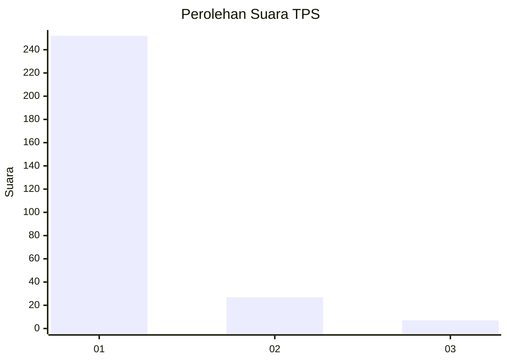
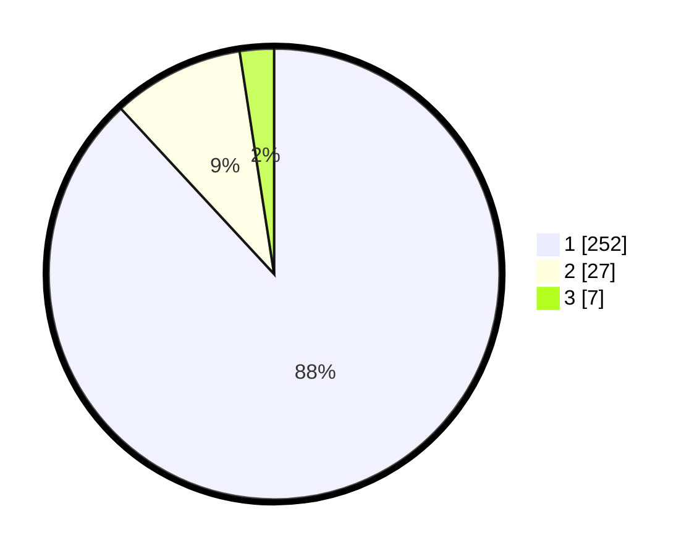

# Hasil

## Grafik

## Tabel

| No. | Nama Paslon    | Suara | Suara (raw) | Persentase |
|:--- |:-------------- | -----:| -----------:| ----------:|
| 1   | ANIES MUHAIMIN | 252   | [252][p-1]  | 88,11      |
| 2   | PRABOWO GIBRAN | 27    | [27][p-2]   | 9,44       |
| 3   | GANJAR MAHFUD  | 7     | [7][p-3]    | 2,45       |

[p-1]: https://github.com/gigit-pemilu/pemilu-2024-11-aceh/blob/main/pilpres/hitung-suara/sub/11-aceh/sub/75-kota-subulussalam/sub/04-sultan-daulat/sub/2013-namo-buaya/sub/001-tps/sub/paslon-1.txt
[p-2]: https://github.com/gigit-pemilu/pemilu-2024-11-aceh/blob/main/pilpres/hitung-suara/sub/11-aceh/sub/75-kota-subulussalam/sub/04-sultan-daulat/sub/2013-namo-buaya/sub/001-tps/sub/paslon-2.txt
[p-3]: https://github.com/gigit-pemilu/pemilu-2024-11-aceh/blob/main/pilpres/hitung-suara/sub/11-aceh/sub/75-kota-subulussalam/sub/04-sultan-daulat/sub/2013-namo-buaya/sub/001-tps/sub/paslon-3.txt

## Foto C Plano

https://sirekap-obj-formc.kpu.go.id/09b8/pemilu/ppwp/11/75/04/20/13/1175042013001-20240220-165838--f8ecbf32-d2f8-4246-b324-3f35a55b0026.jpg

https://sirekap-obj-formc.kpu.go.id/09b8/pemilu/ppwp/11/75/04/20/13/1175042013001-20240220-170249--75a5cfaf-37d5-43f3-b9a6-583971f108c5.jpg

https://sirekap-obj-formc.kpu.go.id/09b8/pemilu/ppwp/11/75/04/20/13/1175042013001-20240220-170521--1f959c6d-3801-4a2f-be5f-97f7b2ded135.jpg

## Metadata

| Key        | Value               |
| ---------- | ------------------- |
| Time Stamp | 2024-02-20 18:00:00 |

## DATA PEMILIH TETAP

Jumlah pemilih dalam DPT: **278**.
 * L: **137**.
 * P: **140**.

## DATA PENGGUNA HAK PILIH

Jumlah pengguna hak pilih dalam DPT: **750**.
 * L: **123**.
 * P: **128**.

Jumlah pengguna hak pilih dalam DPTb: **87**.
 * L: **4**.
 * P: **7**.

Jumlah pengguna hak pilih dalam DPK: **0**.
 * L: **0**.
 * P: **0**.

Jumlah pengguna hak pilih: **254**.
 * L: **535**.
 * P: **131**.

## JUMLAH SUARA SAH DAN TIDAK SAH

JUMLAH SELURUH SUARA SAH: **242**.

JUMLAH SUARA TIDAK SAH: **15**.

JUMLAH SELURUH SUARA SAH DAN SUARA TIDAK SAH: **257**.

