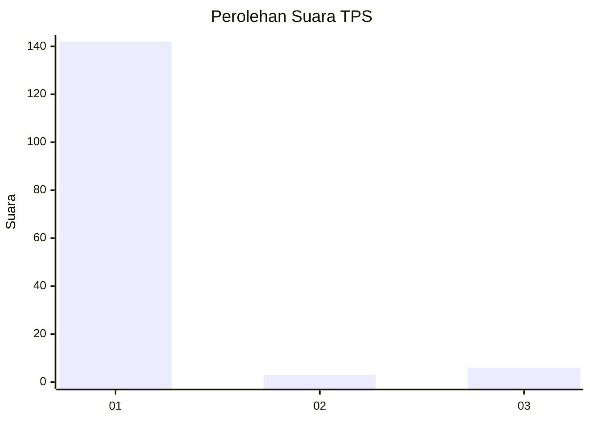
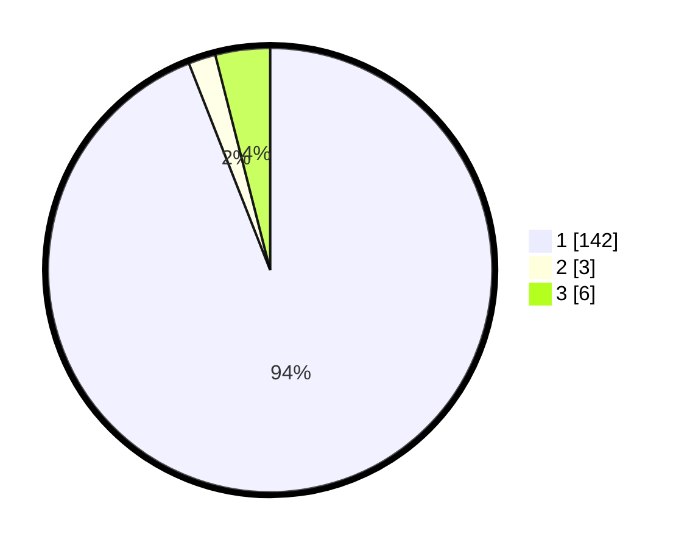

# Hasil

## Grafik

## Tabel

| No. | Nama Paslon    | Suara | Suara (raw) | Persentase |
|:--- |:-------------- | -----:| -----------:| ----------:|
| 1   | ANIES MUHAIMIN | 142   | [142][p-1]  | 94,04      |
| 2   | PRABOWO GIBRAN | 3     | [3][p-2]    | 1,99       |
| 3   | GANJAR MAHFUD  | 6     | [6][p-3]    | 3,97       |

[p-1]: https://github.com/gigit-pemilu/pemilu-2024-11-aceh/blob/main/pilpres/hitung-suara/sub/11-aceh/sub/75-kota-subulussalam/sub/04-sultan-daulat/sub/2013-namo-buaya/sub/002-tps/sub/paslon-1.txt
[p-2]: https://github.com/gigit-pemilu/pemilu-2024-11-aceh/blob/main/pilpres/hitung-suara/sub/11-aceh/sub/75-kota-subulussalam/sub/04-sultan-daulat/sub/2013-namo-buaya/sub/002-tps/sub/paslon-2.txt
[p-3]: https://github.com/gigit-pemilu/pemilu-2024-11-aceh/blob/main/pilpres/hitung-suara/sub/11-aceh/sub/75-kota-subulussalam/sub/04-sultan-daulat/sub/2013-namo-buaya/sub/002-tps/sub/paslon-3.txt

## Foto C Plano

https://sirekap-obj-formc.kpu.go.id/4538/pemilu/ppwp/11/75/04/20/13/1175042013002-20240220-173757--f1ebaaa4-055c-43d4-94f1-0d6e78622be0.jpg

https://sirekap-obj-formc.kpu.go.id/4538/pemilu/ppwp/11/75/04/20/13/1175042013002-20240220-173842--46b9dca8-1b4e-4f20-b17b-10efa973e1ed.jpg

https://sirekap-obj-formc.kpu.go.id/4538/pemilu/ppwp/11/75/04/20/13/1175042013002-20240220-173924--1de78bae-ce8f-4b6b-bf8c-249fcaae0e80.jpg

## Metadata

| Key        | Value               |
| ---------- | ------------------- |
| Time Stamp | 2024-02-20 18:00:00 |

## DATA PEMILIH TETAP

Jumlah pemilih dalam DPT: **286**.
 * L: **0**.
 * P: **4**.

## DATA PENGGUNA HAK PILIH

Jumlah pengguna hak pilih dalam DPT: **0**.
 * L: **500**.
 * P: **5**.

Jumlah pengguna hak pilih dalam DPTb: **500**.
 * L: **555**.
 * P: **555**.

Jumlah pengguna hak pilih dalam DPK: **10**.
 * L: **0**.
 * P: **5**.

Jumlah pengguna hak pilih: **266**.
 * L: **143**.
 * P: **123**.

## JUMLAH SUARA SAH DAN TIDAK SAH

JUMLAH SELURUH SUARA SAH: **251**.

JUMLAH SUARA TIDAK SAH: **500**.

JUMLAH SELURUH SUARA SAH DAN SUARA TIDAK SAH: **7**.

