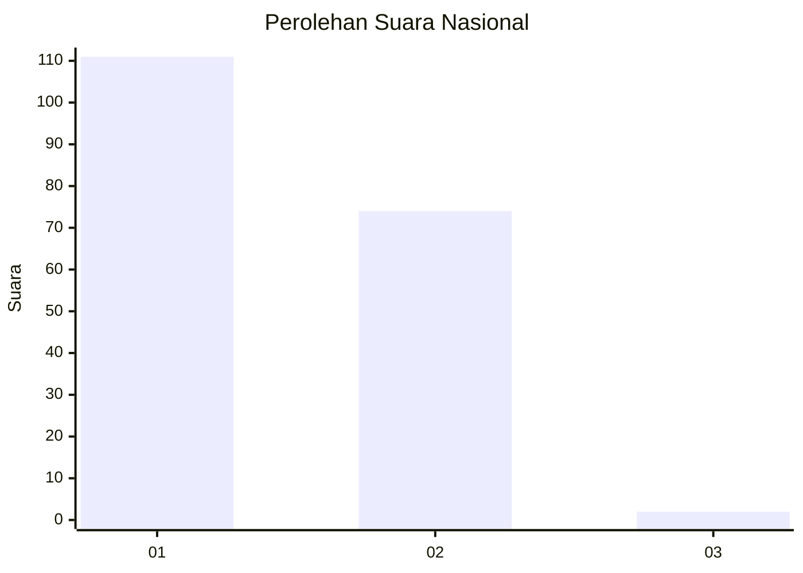
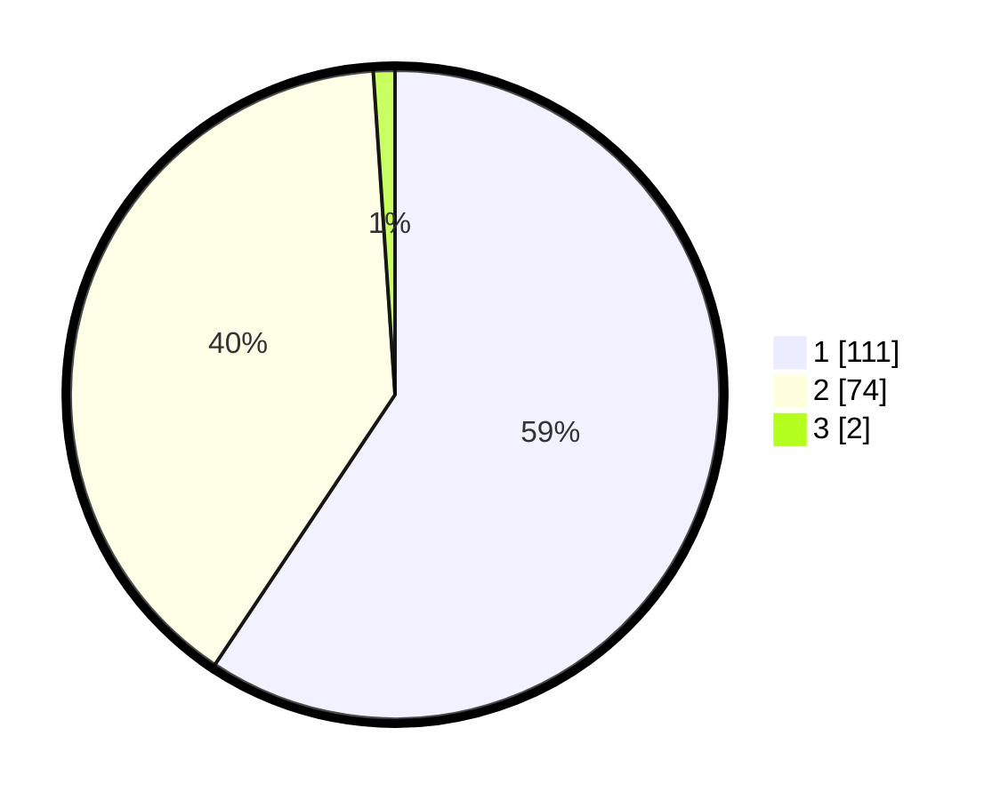

# Hasil

## Grafik

## Tabel

| No. | Nama Paslon    | Suara | Suara (raw) | Persentase |
|:--- |:-------------- | -----:| -----------:| ----------:|
| 1   | ANIES MUHAIMIN | 111   | [111][p-1]  | 59,36      |
| 2   | PRABOWO GIBRAN | 74    | [74][p-2]   | 39,57      |
| 3   | GANJAR MAHFUD  | 2     | [2][p-3]    | 1,07       |

[p-1]: https://github.com/gigit-pemilu/pemilu-2024/blob/main/pilpres/hitung-suara/sub/11-aceh/sub/75-kota-subulussalam/sub/04-sultan-daulat/sub/2015-bunga-tanjung/sub/002-tps/sub/paslon-1.txt
[p-2]: https://github.com/gigit-pemilu/pemilu-2024/blob/main/pilpres/hitung-suara/sub/11-aceh/sub/75-kota-subulussalam/sub/04-sultan-daulat/sub/2015-bunga-tanjung/sub/002-tps/sub/paslon-2.txt
[p-3]: https://github.com/gigit-pemilu/pemilu-2024/blob/main/pilpres/hitung-suara/sub/11-aceh/sub/75-kota-subulussalam/sub/04-sultan-daulat/sub/2015-bunga-tanjung/sub/002-tps/sub/paslon-3.txt

## Foto C Plano

https://sirekap-obj-formc.kpu.go.id/4366/pemilu/ppwp/11/75/04/20/15/1175042015002-20240221-221749--25f68908-6b25-4181-a940-eb92dbba2894.jpg

https://sirekap-obj-formc.kpu.go.id/4366/pemilu/ppwp/11/75/04/20/15/1175042015002-20240221-221524--e8d23cc1-0baf-4474-888f-ca10a86359ee.jpg

https://sirekap-obj-formc.kpu.go.id/4366/pemilu/ppwp/11/75/04/20/15/1175042015002-20240221-221332--a1e92230-fd80-44f2-88bc-103e082646b0.jpg

## Metadata

| Key        | Value               |
| ---------- | ------------------- |
| Time Stamp | 2024-02-21 23:00:00 |

