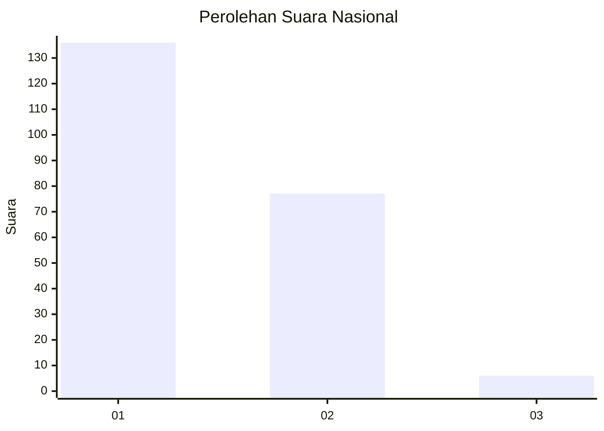
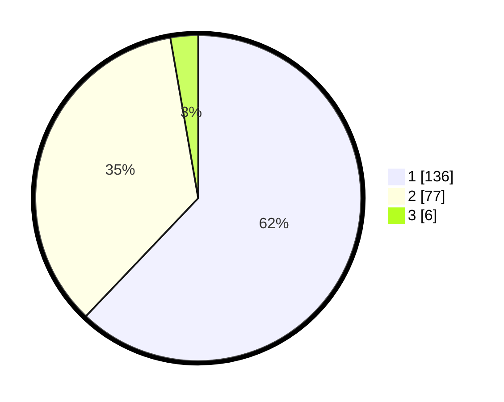

# Hasil

## Grafik

## Tabel

| No. | Nama Paslon    | Suara | Suara (raw) | Persentase |
|:--- |:-------------- | -----:| -----------:| ----------:|
| 1   | ANIES MUHAIMIN | 136   | [136][p-1]  | 62,10      |
| 2   | PRABOWO GIBRAN | 77    | [77][p-2]   | 35,16      |
| 3   | GANJAR MAHFUD  | 6     | [6][p-3]    | 2,74       |

[p-1]: https://github.com/gigit-pemilu/pemilu-2024/blob/main/pilpres/hitung-suara/sub/11-aceh/sub/75-kota-subulussalam/sub/04-sultan-daulat/sub/2019-jabi-jabi-barat/sub/001-tps/sub/paslon-1.txt
[p-2]: https://github.com/gigit-pemilu/pemilu-2024/blob/main/pilpres/hitung-suara/sub/11-aceh/sub/75-kota-subulussalam/sub/04-sultan-daulat/sub/2019-jabi-jabi-barat/sub/001-tps/sub/paslon-2.txt
[p-3]: https://github.com/gigit-pemilu/pemilu-2024/blob/main/pilpres/hitung-suara/sub/11-aceh/sub/75-kota-subulussalam/sub/04-sultan-daulat/sub/2019-jabi-jabi-barat/sub/001-tps/sub/paslon-3.txt

## Foto C Plano

https://sirekap-obj-formc.kpu.go.id/063a/pemilu/ppwp/11/75/04/20/19/1175042019001-20240214-212050--80d8f54a-0e24-469e-9953-36223d6a2b6a.jpg

https://sirekap-obj-formc.kpu.go.id/063a/pemilu/ppwp/11/75/04/20/19/1175042019001-20240214-212124--1ed82d32-ccac-49bd-9ac0-69af3c7d8490.jpg

https://sirekap-obj-formc.kpu.go.id/063a/pemilu/ppwp/11/75/04/20/19/1175042019001-20240214-212148--9dee0662-6d81-446b-aa53-ba01af36680e.jpg

## Metadata

| Key        | Value               |
| ---------- | ------------------- |
| Time Stamp | 2024-02-15 22:00:27 |

