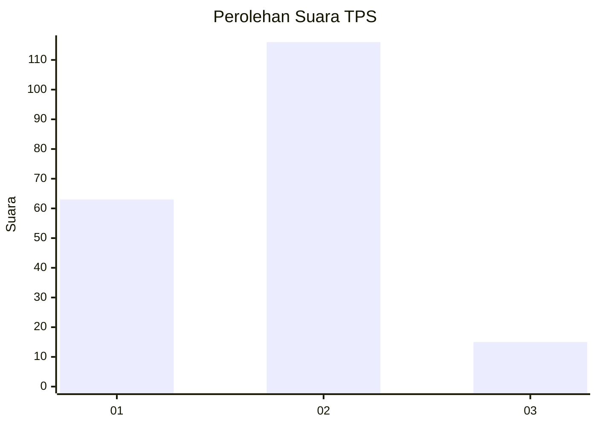
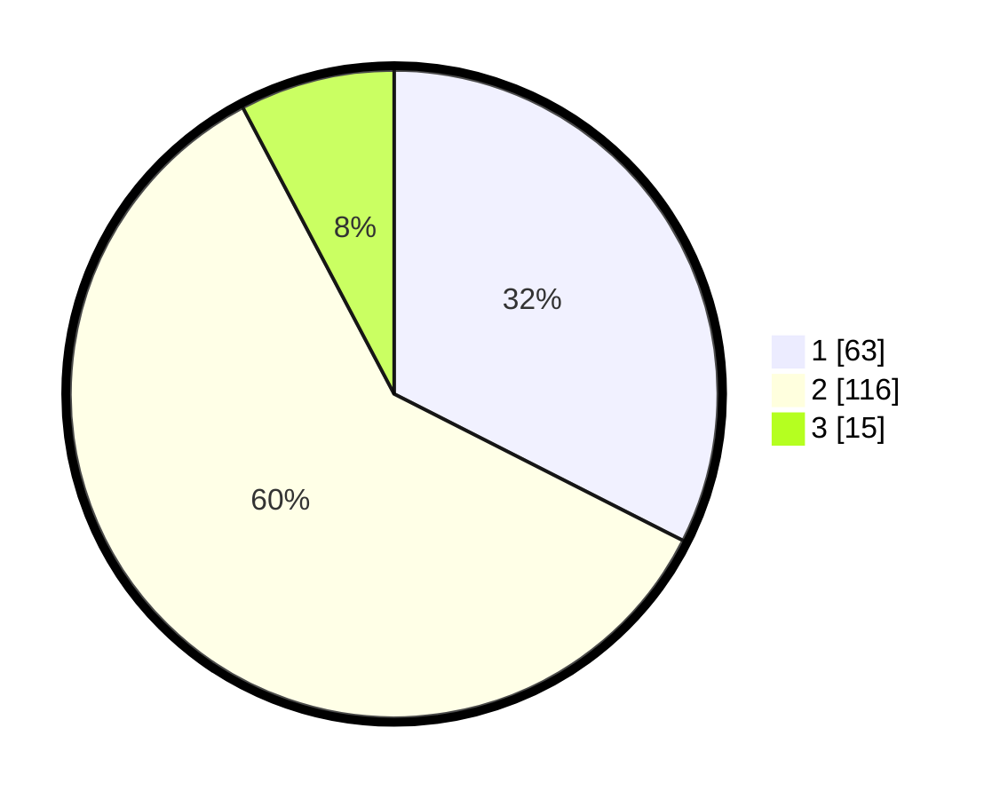

# Hasil

## Grafik

## Tabel

| No. | Nama Paslon    | Suara | Suara (raw) | Persentase |
|:--- |:-------------- | -----:| -----------:| ----------:|
| 1   | ANIES MUHAIMIN | 63    | [63][p-1]   | 32,47      |
| 2   | PRABOWO GIBRAN | 116   | [116][p-2]  | 59,79      |
| 3   | GANJAR MAHFUD  | 15    | [15][p-3]   | 7,73       |

[p-1]: https://github.com/gigit-pemilu/pemilu-2024-11-aceh/blob/main/pilpres/hitung-suara/sub/11-aceh/sub/75-kota-subulussalam/sub/05-longkib/sub/2004-lae-saga/sub/001-tps/sub/paslon-1.txt
[p-2]: https://github.com/gigit-pemilu/pemilu-2024-11-aceh/blob/main/pilpres/hitung-suara/sub/11-aceh/sub/75-kota-subulussalam/sub/05-longkib/sub/2004-lae-saga/sub/001-tps/sub/paslon-2.txt
[p-3]: https://github.com/gigit-pemilu/pemilu-2024-11-aceh/blob/main/pilpres/hitung-suara/sub/11-aceh/sub/75-kota-subulussalam/sub/05-longkib/sub/2004-lae-saga/sub/001-tps/sub/paslon-3.txt

## Foto C Plano

https://sirekap-obj-formc.kpu.go.id/54d9/pemilu/ppwp/11/75/05/20/04/1175052004001-20240215-111431--ead2cc6c-8852-4c8e-a6cf-48d6b9d17017.jpg

https://sirekap-obj-formc.kpu.go.id/54d9/pemilu/ppwp/11/75/05/20/04/1175052004001-20240215-111452--efc9b87b-37d0-4a40-b4b7-7c0c2544c32c.jpg

https://sirekap-obj-formc.kpu.go.id/54d9/pemilu/ppwp/11/75/05/20/04/1175052004001-20240215-111442--715c2056-d5bf-4e1a-8c95-d24cd83971ee.jpg

## Metadata

| Key        | Value               |
| ---------- | ------------------- |
| Time Stamp | 2024-02-20 17:00:00 |

## DATA PEMILIH TETAP

Jumlah pemilih dalam DPT: **217**.
 * L: **100**.
 * P: **117**.

## DATA PENGGUNA HAK PILIH

Jumlah pengguna hak pilih dalam DPT: **199**.
 * L: **91**.
 * P: **108**.

Jumlah pengguna hak pilih dalam DPTb: **2**.
 * L: **1**.
 * P: **1**.

Jumlah pengguna hak pilih dalam DPK: **1**.
 * L: **0**.
 * P: **1**.

Jumlah pengguna hak pilih: **202**.
 * L: **92**.
 * P: **200**.

## JUMLAH SUARA SAH DAN TIDAK SAH

JUMLAH SELURUH SUARA SAH: **194**.

JUMLAH SUARA TIDAK SAH: **5**.

JUMLAH SELURUH SUARA SAH DAN SUARA TIDAK SAH: **199**.

