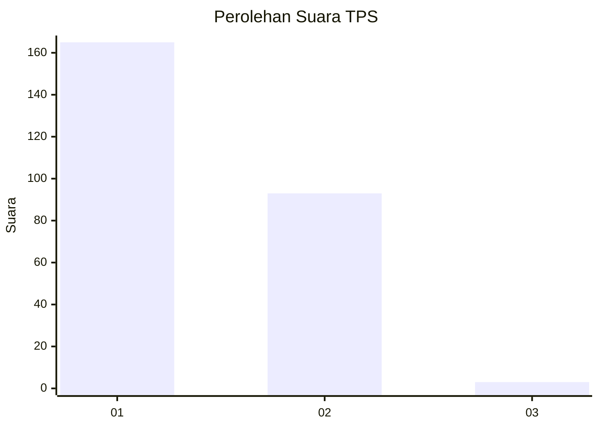
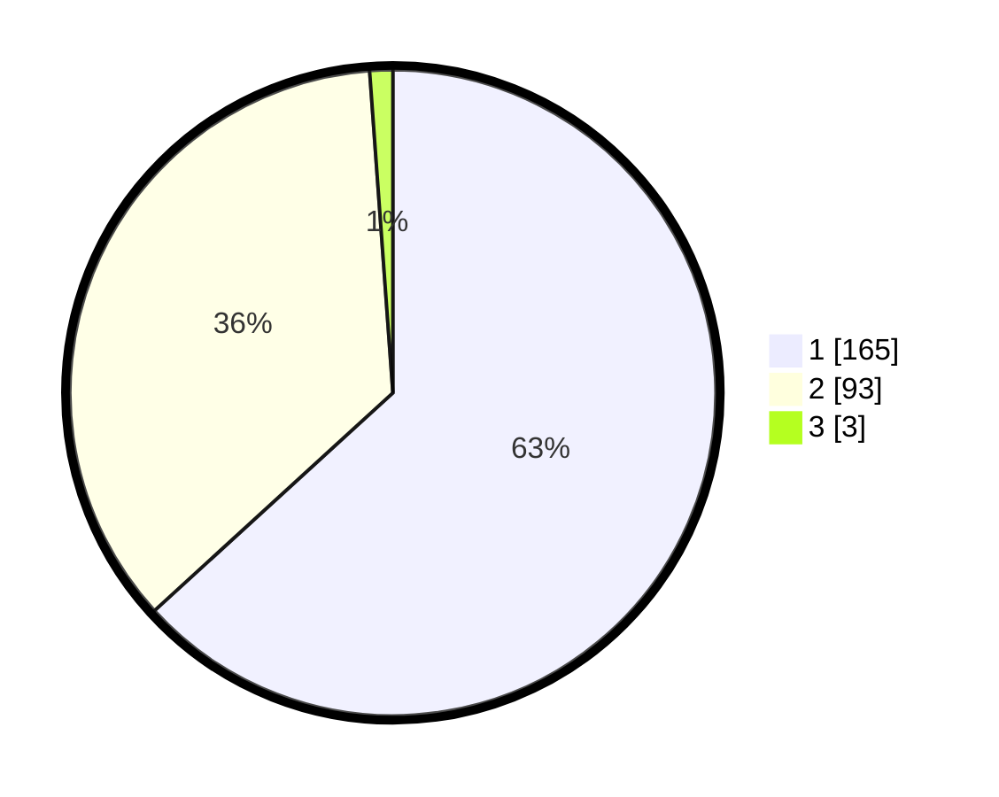

# Hasil

## Grafik

## Tabel

| No. | Nama Paslon    | Suara | Suara (raw) | Persentase |
|:--- |:-------------- | -----:| -----------:| ----------:|
| 1   | ANIES MUHAIMIN | 165   | [165][p-1]  | 63,22      |
| 2   | PRABOWO GIBRAN | 93    | [93][p-2]   | 35,63      |
| 3   | GANJAR MAHFUD  | 3     | [3][p-3]    | 1,15       |

[p-1]: https://github.com/gigit-pemilu/pemilu-2024-11-aceh/blob/main/pilpres/hitung-suara/sub/11-aceh/sub/75-kota-subulussalam/sub/05-longkib/sub/2008-darul-aman/sub/001-tps/sub/paslon-1.txt
[p-2]: https://github.com/gigit-pemilu/pemilu-2024-11-aceh/blob/main/pilpres/hitung-suara/sub/11-aceh/sub/75-kota-subulussalam/sub/05-longkib/sub/2008-darul-aman/sub/001-tps/sub/paslon-2.txt
[p-3]: https://github.com/gigit-pemilu/pemilu-2024-11-aceh/blob/main/pilpres/hitung-suara/sub/11-aceh/sub/75-kota-subulussalam/sub/05-longkib/sub/2008-darul-aman/sub/001-tps/sub/paslon-3.txt

## Foto C Plano

https://sirekap-obj-formc.kpu.go.id/6b92/pemilu/ppwp/11/75/05/20/08/1175052008001-20240219-144214--f5188e97-b887-444c-9287-f7807126eace.jpg

https://sirekap-obj-formc.kpu.go.id/6b92/pemilu/ppwp/11/75/05/20/08/1175052008001-20240219-144331--d19c4bc3-f6e4-4fe7-aecb-3a4082606bdf.jpg

https://sirekap-obj-formc.kpu.go.id/6b92/pemilu/ppwp/11/75/05/20/08/1175052008001-20240219-144821--4729a3d5-2c57-4151-9bc9-b272295c6c1c.jpg

## Metadata

| Key        | Value               |
| ---------- | ------------------- |
| Time Stamp | 2024-02-19 15:00:00 |

## DATA PEMILIH TETAP

Jumlah pemilih dalam DPT: **282**.
 * L: **143**.
 * P: **139**.

## DATA PENGGUNA HAK PILIH

Jumlah pengguna hak pilih dalam DPT: **261**.
 * L: **133**.
 * P: **128**.

Jumlah pengguna hak pilih dalam DPTb: **89**.
 * L: **885**.
 * P: **884**.

Jumlah pengguna hak pilih dalam DPK: **1**.
 * L: **8**.
 * P: **0**.

Jumlah pengguna hak pilih: **271**.
 * L: **139**.
 * P: **132**.

## JUMLAH SUARA SAH DAN TIDAK SAH

JUMLAH SELURUH SUARA SAH: **262**.

JUMLAH SUARA TIDAK SAH: **0**.

JUMLAH SELURUH SUARA SAH DAN SUARA TIDAK SAH: **278**.

